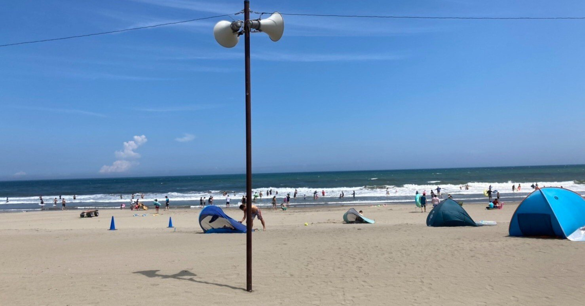
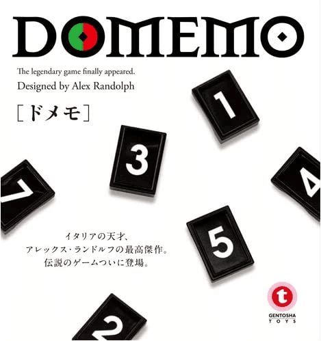
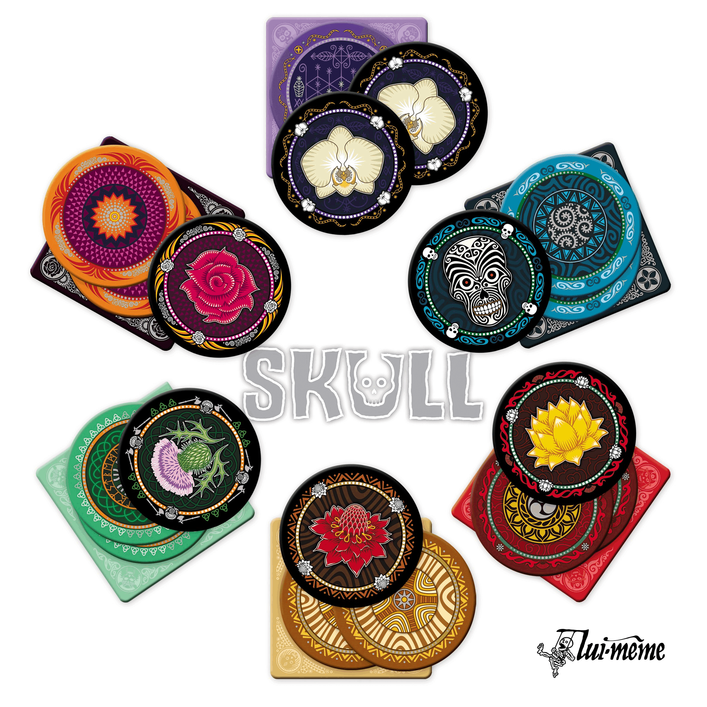
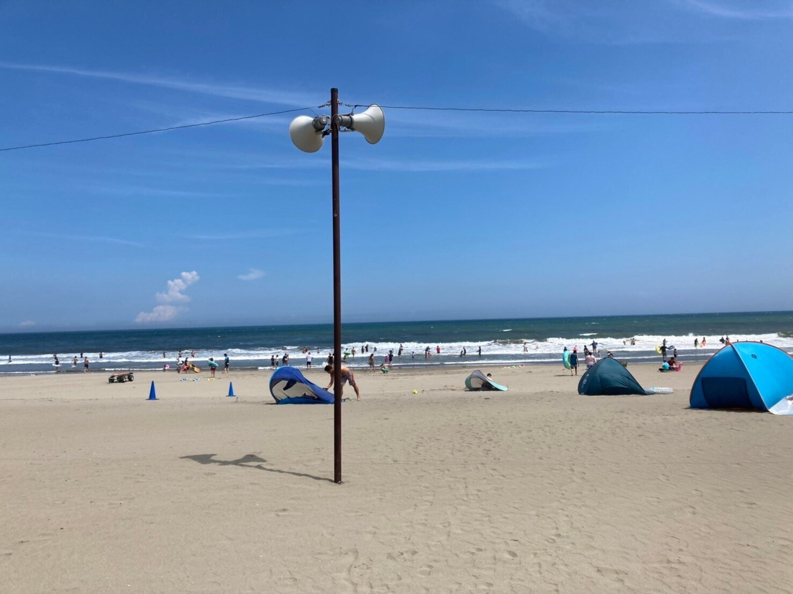
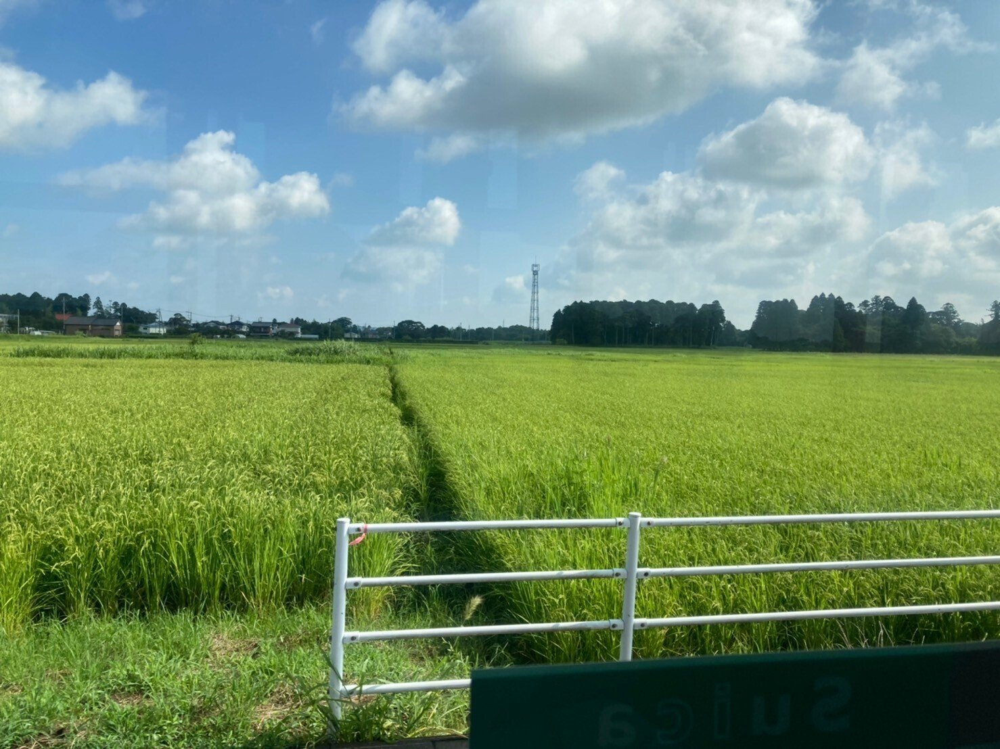
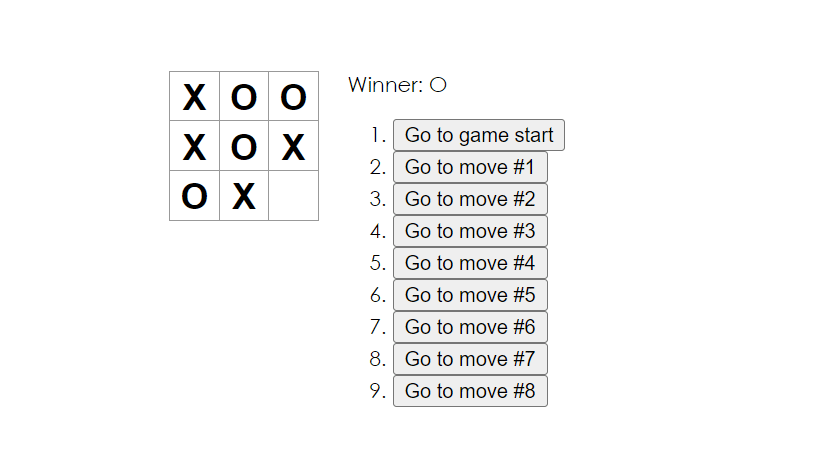
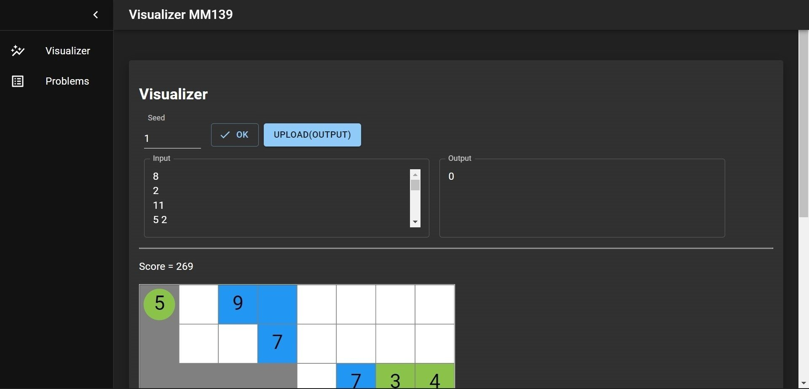
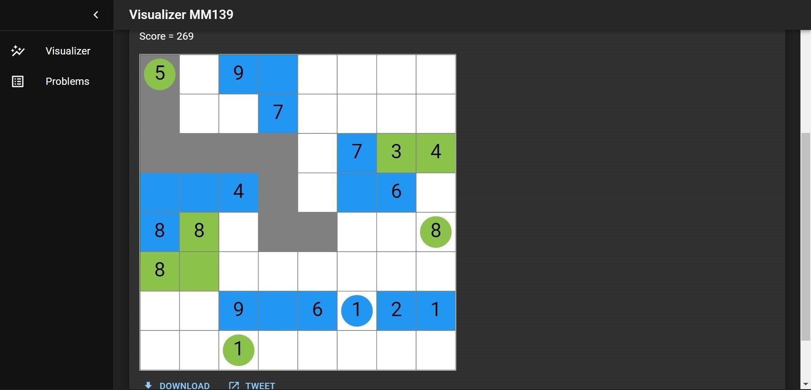
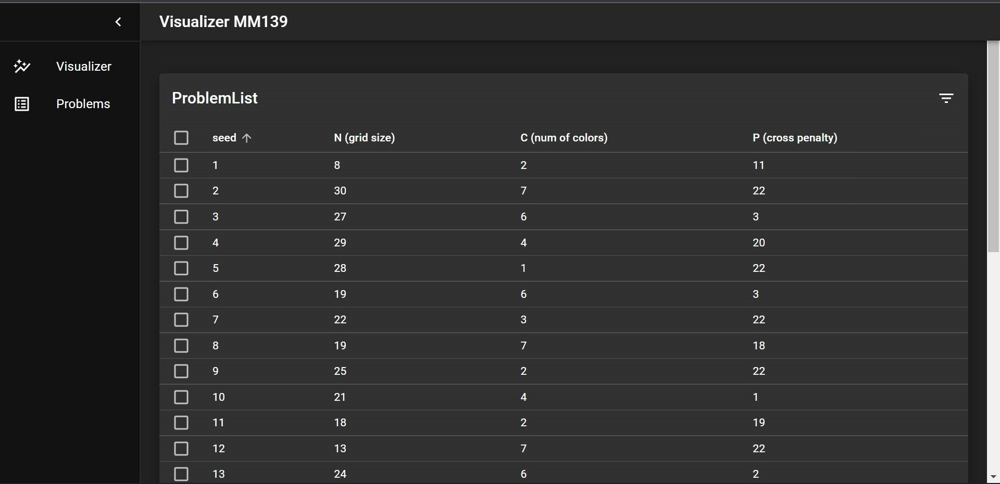

<figure>

</figure>

2022年の8月について、少しだけ月記を書きます。  
思い出に残ればいいなという期待を込めて。

## ボードゲーム

ここ一カ月間で、これが一番楽しかったです。ボードゲームにはあまり興味がない人間だったのですが、幸運にも二回ほど、友人と一緒にボードゲームカフェに行く機会に恵まれました。(それぞれ別の人達と行きました。)

びっくりするくらい楽しかったです。

ところで、この時ほぼ初めましての人にも会ったんですが、何というか、あまりにも非の打ち所がなくて、「頭が良くて、顔も良くて、おまけに性格も良いような人間と付き合える女性というのは、さぞかし幸福なんだろうな」みたいなことをぼんやり考えていました。いい人と知り合えて良かったです。

色々面白かったゲームがあるのですが、「DOMEMO」と「花と髑髏」が個人的にかなり好きだったので、少しだけ書きます。

* * *

### DOMEMO

<figure>

<figcaption>

DOMEMO

</figcaption>

</figure>

<figure>

> プレーヤーには1から7の数字が描かれたピースが何枚か手札として配られます。自分の手札は自分からは見えないように、他のプレーヤーからは見えるように並べ、各プレーヤーは他のプレーヤーの手札と場札に現れている数字から、自分の手札の数字を推理して当てていきます。当てられた数字の札は場に捨てていき、すべての手札がなくなれば勝ち抜けとなります。

<figcaption>

出典: [パズルショップ・トリト](https://torito.jp/shopping/item.cgi?_domemo-w)

</figcaption>

</figure>

要するに、単純な数当てゲームなんですが、奥深さがありました。これ、頑張るとたった一回だけで全部の推理が完了してゲームが終了するですよね。  
(ゲームの崩壊では?と思われるかもしれないですが、その分ギリギリで外した時に相手に与える情報量がかなり多くて、博打に似たハイリスクハイリターンになります)  
  
友人の一人が、このゲームで遊んでいる時に一種の演技もしていて、ものの見事に騙されました。ああいった演技が出来る人は凄いなとよく感心します。

### 花と髑髏

<figure>

<figcaption>

花と髑髏

</figcaption>

</figure>

SKULLとも言うそうです。

<figure>

> 手元にあるのは3枚の「花」と1枚の「ドクロ」。誰かが勝負を始めるまで、プレイヤーは1枚ずつこの中から好きなカードを出していきます。出されたカードをある枚数、「ドクロ」をめくらずに「花」だけをめくりきることができると思ったプレイヤーは、その数字を宣言し勝負することができます。その瞬間から、この「枚数」をより多く言えるかの勝負となります。他のプレイヤーが下りたとき、もっとも宣言枚数の多いプレイヤーは、出されているカードを1枚ずつ、「ドクロ」を出すことなく宣言枚数までめくっていければ1勝です。

<figcaption>

出典: [Hobby Japan](https://hobbyjapan.games/skull/)

</figcaption>

</figure>

このゲームは以前これまた別の友人達とやったことがあったのですが、その時はルールを間違えていて、自分が伏せたカードは必ずしもめくらなくても良いとしていました。  
しかし、それはどうやら駄目らしく、自分が伏せたカードは最低一枚ひっくり返す必要があるようです。

この制約が増えたことで、以前やった時よりも嘘が混ぜにくいのかと思ったのですが、実はそうでもないというのがかなり意外でした。

このゲームも、一緒に遊んでいた友人の一人が演技をしていて、騙されました。すげー。

* * *

楽しかった。またどっか一緒に遊びに行こうね。

## 小旅行

みなとみらいと千葉に行ってました。

これまたそれぞれ別の友人と行ったんですが、やはり良い友人に恵まれると外出は楽しいですね。ありがたいことです。

千葉の方は、遊びに行くというよりは、高校時代の部活の合宿にお邪魔したという感じだったのですが、それでもなお、都会と違った景色は素晴らしかったです。現役時代にも訪れた場所ではあったのですが、きっとその頃は風景を楽しむ余裕はあまりなかったのだなと、過去を振り返っていました。

<figure>

<figcaption>

久しぶりに訪れた海岸は、色々と変化がありましたが、海だけは変わらず綺麗でした。

</figcaption>

</figure>

<figure>

<figcaption>

バスからの景色

</figcaption>

</figure>

* * *

ところで、来月は今のところ外出の予定が一つもないのですが、どっかには行きたいです。他力本願だけど、誰か誘ってくれないかな……

## 絵

友人宅に行って少しだけ絵を描きました。自分はめっちゃ下手になっててウケました。ちなみに、その家の方はめっちゃ絵が上手かったです。

TwitterのFFの方でも何名か絵を描かれる方がいらっしゃって、皆さん上手だなと、しきりに感心しています。

私も久しぶりに何か作ろうかと思ったので、来月は何かしているかも知れません。(多分…… アイコンを変えたいので)

ついでに、その友人宅に行った際に、私が過去に制作した作品(と呼べるのか?)に関連したお土産ももらいました。  
  
私は高校の受験期前後と大学の1,2年目のあたりに、絵や3DCGへかなり傾注していて(遺物を[pixiv](https://t.co/jUtGXmnVaD)に少しだけあげています)、今でも結構そのことを、(後悔とまでは言わないけれど)否定的に捉えることもあります。この時期に別のことをしていたら、もっと別の今の在り方もあったのかも知れないなぁ、と。  
  
どう振り返ろうが美化出来ない過去を、私はいくつも持ち合わせているですが、それでも、こういう日を過ごしたり、こういうお土産を誰かにもらえたりするのならば、少しはその意味もあったのかなと思えます。

ありがとう。

## 競プロ

### AHC013

アルゴもヒューリスティックも、あまり取り組めませんでした。  
AHC013にだけは真面目に出ていました。

[https://twitter.com/hari64boli64/status/1559671898471944192](https://twitter.com/hari64boli64/status/1559671898471944192)

大分苦戦したんですが、賞金を頂けたので、1万円ほどプラスしてUNHCRに募金しました。  
  
(前回別のコンテストで賞金をもらった時もそうしたんですが、その時から国際情勢は一向に変わっておらず残念でなりません。  
最近の話をすると、核拡散防止条約（NPT）再検討会議の決裂は相当にショックでした。このレベルの会議が当たり前のように決裂することは、あまり残酷です。

世界が平和を取り戻すことを切に願っています。)

### Visualizer

競プロに関連して、Visualizerを自作しようかなという気になり、個人的な興味があったReactを少し勉強していました。  
例えば、[公式tutorial](https://ja.reactjs.org/tutorial/tutorial.html)をこなして〇×ゲームを作っていました。

<figure>

<figcaption>

作成した〇×ゲーム Typescriptの型を指定するのが難しかったです

</figcaption>

</figure>

最初はJSXなどの御利益などがあんまりピンと来ていなかったのですが、少しずつ分かってくると当初の想像以上に強力で面白いです。  
  
また、TERRYさんと言う方がyukicoderで[Steiner Space Travel](https://yukicoder.me/problems/no/5007)と言う問題を7月末に出題されており、そのビジュアライザの構成が凄く好きだったので、似たようなテンプレート([material-ui](https://mui.com/material-ui/getting-started/templates/)のDashboard)を探してからビジュアライザを作成しました。  
ただ、これが思っていた以上に張りぼてだったので苦労しています。始めたのがまだ4,5日前くらいなもので、まだまだ未完ですが、少しは形になりました。([リンク](https://github.com/hari64boli64/visualizer))

<figure>

<figcaption>

このような入出力の画面があって、

</figcaption>

</figure>

<figure>

<figcaption>

クリックやタップでもリアクティブに動作するようにしています

</figcaption>

</figure>

<figure>

<figcaption>

データベース的な機能も付けました

</figcaption>

</figure>

9月もちょくちょく更新しようと思っています。

## バイト

倫理と政経の模試の、校正のバイトをしているんですが、時間的にはこれがこの一カ月のほぼ5,6割を占めています。なんか、自分の意思と関係なくエグイ量を割り振られました。(競プロが碌に出来なかった一因です)

ずっとこの仕事ばかりしていたら頭が痛くなりました。つまらないので詳細は書きません。  
  
尤も、ニュースをだらだら眺める時間を仕事の一環と正当化できるのは、ありがたくはあるんですが。

ちなみに、別記事にちらっと豆知識みたいなのを書こうかと思ったのですが、書いては消してを繰り返していたら、まだほぼ白紙です。その内投稿するかも知れません。  
  
後、少しだけ別のバイトでTypescriptなどを書かせて頂いていて、そっちは楽しかったです。とあるプロジェクトでは、社員さんにご迷惑をおかけしてごめんなさいになりました。

ただ、103万の壁もあるので、来月以降はダラダラしたいです。

* * *

以上です。  
来月はICFPCなどがあります。頑張ります。
