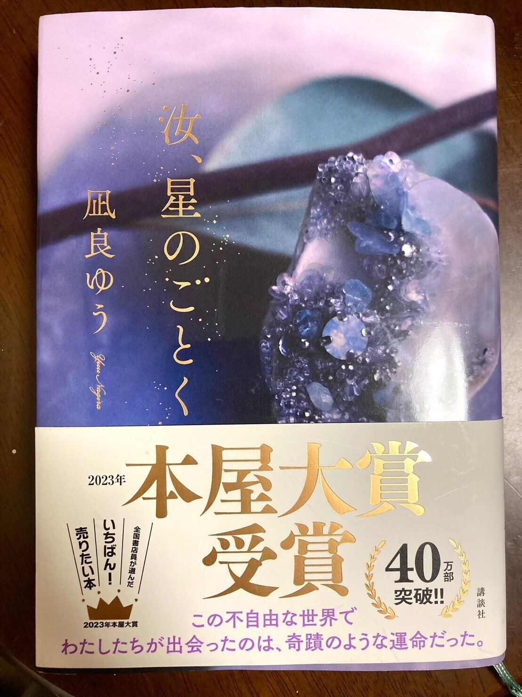
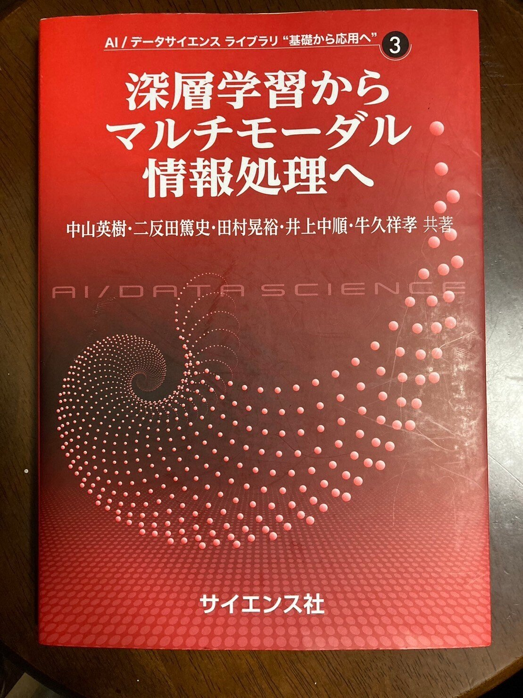

<figure>

</figure>

## 本

### 汝、星のごとく

今年の本屋大賞に輝いた、凪良ゆうさんの『汝、星のごとく』という本を買って読みました。

<figure>

</figure>

凄かったです。

これは確かに本屋大賞だなと思いました。

なにより、この本が本屋大賞に輝いたという、その事実こそが、物語を真に完結させている気がします。

本当にすごい。

ところで、京浜東北線に乗っている最中、ふと目を上げたら車内にこの本の広告があったのですが、夏の夜空に打ち上る花火を宣伝の写真に使っていて、死ぬかと思いました。軽率に既読勢を殺しに来ている。

### 子供の科学

稲見先生という方が私の所属する学部にいらっしゃり、その先生が出ていたので買ってきました。

<figure>

<figcaption>

右下の「自在化身体プロジェクト」というのが先生の研究です

</figcaption>

</figure>

この本にはペーパークラフトがついていて、「6本目の指」という、稲見先生が取り組まれている作品(?)が作れるようになっています。

作成難度というのがペーパークラフトには記載されており、星が5段階中2つだったので、じゃあ私でも作れるかと思って作ったら、ものの見事に紙屑になってしまいました。先生本当にごめんなさい……

私が不器用すぎたのですが、本当はこんな風になるそうです。

[https://twitter.com/RukiRuki475/status/1651944225330851843](https://twitter.com/RukiRuki475/status/1651944225330851843)

すげ~~

ちなみに本家はこれらしいです。

[https://twitter.com/jizai\_body/status/1633784706234740736](https://twitter.com/jizai_body/status/1633784706234740736)

すげ~~~

### 深層学習

「深層学習からマルチモーダル情報処理へ」という本を買って、読み途中です。

<figure>

<figcaption>

とても赤い

</figcaption>

</figure>

思ったより数式が出てこなくて意外でした。

YOLOというのに今月は縁があったのですが、この本にも出てきてちょっぴり感動しました。

* * *

以前読み残していたベイズに関する本を大体読み終わりました。実用重視すぎて、理論は結局あまり分かりませんでした。

Kaggleの本は、知っている話こそ多かったものの、面白かったです。  
  
他には、ガウス過程の本がkindle版で安かったので、買いました。  
来月からゆっくり読もうと思います。

バイトに関連する本を一冊買って読んだのですが、これも面白かったものの、結局バイトの役には全く立ちませんでした。経費で落ちるかなと思って買ったら、落ちませんでした。

住野よるさんの「青くて脆くて痛い」がセールか何かをやっていて、読みました。面白かったです。ちょっと斜め読みでしたが。

## プログラミング

### GitHub Copilot

先月は使えないと言っていましたが、最近はすっかり虜です。  
以前は扱い方が悪かったようです。

プログラミングを書く際だけでなく、Markdownなどを書いていても有用なので、本当に便利です。以前数式を書いていたら、完璧な式変形を提示されて思わず声が出ました。

このレベルで推論されることは流石に稀ですが、それでも圧倒的に強力です。

### AHC020

楽しみにしていたのに、AtCoder社に対するDDoS攻撃のせいで延期になりました。残念。

最近は復旧しているらしく、エンジニアの方々に感謝です。

### 環境構築

諸事情あって、今月は環境構築に苦しめられることが多かったです。

ところで、環境構築などをしていてエラーが発生した際、まず見るべきは公式ドキュメントかGitHubのIssueのどちらかであるべき、とはよく言われることだと思います。しかし、私は英語が苦手なので、そういう時でもついついQiitaとかZennとかの日本語記事を読んでしまいます。

それで問題が解決することも多く、大抵の場合、(世間一般の悪評よりは)良い記事であるように思うので、執筆者の方々には感謝しているのですが、時々、前者の方に圧倒的にスマートな解決方法が提示されていることがあります。というか、ありました。

これとかです↓

[https://github.com/conda/conda/issues/11982](https://github.com/conda/conda/issues/11982)

こういうのって、中々難しいよなぁ、と思う、今日この頃です。

### 最適化手法

(多分、どのイベントなのかなどに関しては、詳しく言及しない方が良い気がするのですが、)とあるウェビナーに参加した日がありました。競プロではないです。

色々初見の話があって面白かったです。

Nelder-Mead法という多変数関数の局所的最適化手法があるらしいです。「アメーバをイメージした手法」って、凄いですね……

[https://ja.wikipedia.org/wiki/%E3%83%8D%E3%83%AB%E3%83%80%E3%83%BC%E2%80%93%E3%83%9F%E3%83%BC%E3%83%89%E6%B3%95](https://ja.wikipedia.org/wiki/%E3%83%8D%E3%83%AB%E3%83%80%E3%83%BC%E2%80%93%E3%83%9F%E3%83%BC%E3%83%89%E6%B3%95)

[https://takashiida.floppy.jp/education/computer-science/gif-nelder-mead/](https://takashiida.floppy.jp/education/computer-science/gif-nelder-mead/)

Harmony Searchという探索方法があるらしいです。「音楽家が即興演奏する際の思考に着目して作られたアルゴリズム」って何事……???

[https://qiita.com/pocokhc/items/f59a0315265c47423122](https://qiita.com/pocokhc/items/f59a0315265c47423122)

本当に強いの? という疑問はあるので眉唾ですが、それはそれとして面白いです。

ちなみに、一番強かったのはかなりシンプルな手法らしいです。

ある意味予定調和ですね。

## バイト

「絶対解けるはず」と思っている問題が、ずっと解けていません。

もしかしたら真に解けないのかも知れませんが。

そろそろ病みそう。

## 大学

4年目になりました。  
いくつか面白い授業があって楽しいです。

マハラノビス距離と最急降下法の幾何学的解釈が、個人的に最高でした。

* * *

もうすぐGWですね。どこかに出かけたいですが、未定です。

* * *

今日は、とある友人の誕生日らしいです。おめでとう。

先々月の月末も、とある友人の誕生日で、先月の月末は、我が家の愛犬の誕生日だったので、月末というのは何だかおめでたいですね。
