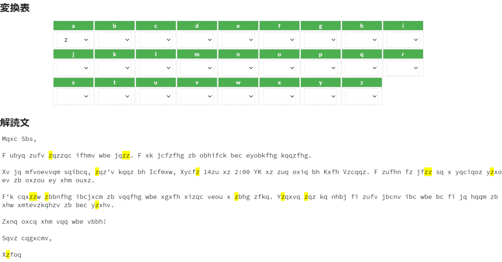
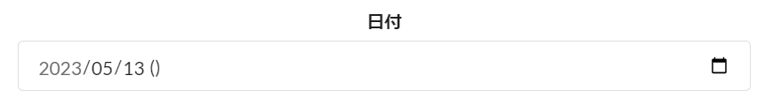
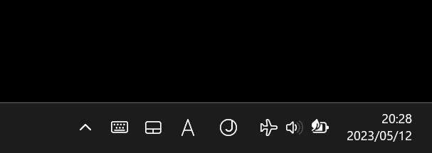
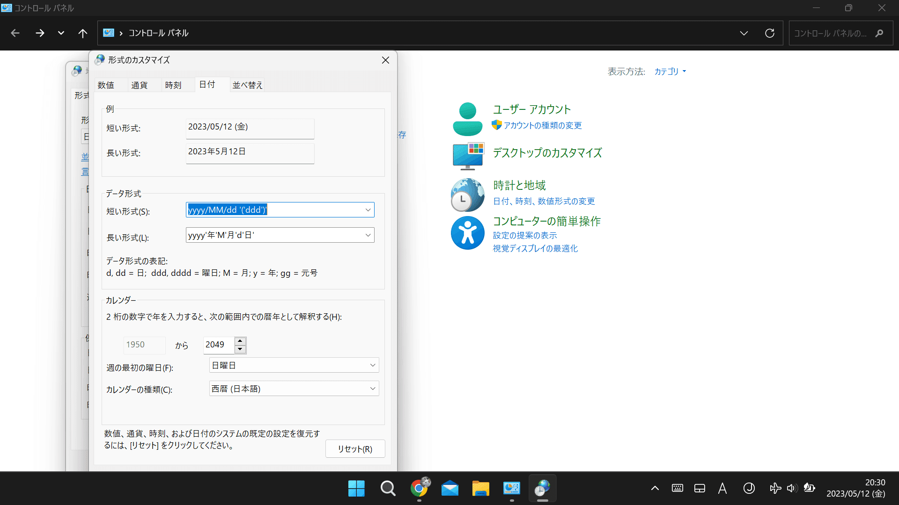

<figure>



</figure>

今月は5月、ということで、東大の文化祭である五月祭がありました。  
  
楽しかったです。

多くの売店があって、美味しいものも沢山食べました。

その五月祭、私は学科の友人に拾われて、暗号と計算機に関する展示のお手伝いをしていました。いい思い出になりましたし、友人には感謝です。

ところで、その展示の手伝いの一環として、以下のものを作りました。

[https://twitter.com/hari64boli64/status/1657877713334734849](https://twitter.com/hari64boli64/status/1657877713334734849)

換字式暗号という暗号の解読ツールです。  
  
ここではそのちょっとした裏話を書きます。

このアプリの開発は、99%の部分は2日で出来た程度の簡単なものだったのですが、非常に細かい、全体の1%にも満たない部分で、結構罠に嵌りました。その主な罠はSafariの仕様に起因するものだったのですが、もう一つ、少し面白い話があったので記そうと思います。

このアプリではHTML5のinputタグで、type="date"としているもの(つまり、日付の情報を入力してもらう欄のこと)が含まれています。丁度、以下のような入力欄です。  
  
これに、五月祭の前夜になって、いきなり変な"()"が入るという謎の現象が発生しました。

<figure>



<figcaption>

2023/05/13が正しいのに、謎の()が生まれてしまっている

</figcaption>

</figure>

はて、一体これは何なのだろう? ほんのつい先日までは、こんな括弧は無かったのに。  
  
スマホやiPadからだと表示されないし、本当に一体なんなんだと頭を抱えました。

まったく原因が分からず、何か変なChromeの仕様変更でも起きたのか? と疑っていましたが、オチを話すと、実は自分のパソコンの設定変更が原因なだけでした。

というのも、この日の前日に、あるネットの情報から、Windowsのデフォルトの日時表示を曜日付きに変えられる、ということを知り、その設定をいじっていました。

<figure>



<figcaption>

Windowsはデフォルトだと、曜日が表示されません

</figcaption>

</figure>

<figure>



<figcaption>

しかし、写真のように設定を変えると、曜日が出るようになります(右下)

</figcaption>

</figure>

設定当時、これは便利だ！とハッピーな気持ちでいたのですが、なんとこれが今回のバグの原因でした。

画像にもありますが、この設定は

```
yyyy/MM/dd '('ddd')'
```

と、曜日、すなわちdddを、括弧で囲んだものを最後に付け加えています。

もしきちんと曜日の情報も取得しているならば、これは正常に表示されます。丁度写真にある「5/12(金)」などのように。

なので無問題と思っていました。

ですが恐らく、今回のHTMLの方では、年月日は情報として取得しているものの、「曜日」の情報を取得していないので、このdddが空白になり、結果として余分な()が出現する、というロジックだったようです。  
  
なるほど……

まさかこんな形で副作用が出るとは全く思わず、非常に驚きました。

このような類のバグは、恐らく初めて遭遇したので、嫌な気持ちにはなりつつも、ちょっと面白かったです。

以上、ちょっとした裏話でした。

* * *

ところで、何の関係もない話題ですが、今月も倫理の模試の校正バイトを少ししていて、全く仕事と関係ない日にふと気が付いた(それ故にここに書いています)どうでも良いことがあるのですが、集合的無意識は種族のイドラの一例と言えそうです。個人的にはなんだかやけに腑に落ちました。(他の方に伝わるのかは微妙ですが……)

また、もう一つどうでも良い事として、話題に「のぼる」の漢字が「上る」だと最近になって明示的に気付きました。ところで話題に「上がる（あがる）」は誤用なのでしょうか？　実はよく分かっていません。

日本語は楽しいですが、難しいですね。

最近つくづく、そう思います。

* * *

今月は以上です。

こんなつまらない月記でも、毎月一定数は読んで下さる方がいるそうで、いつも非常に感謝しています。  
ありがとうございます。
