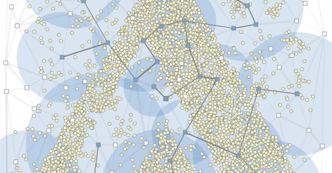
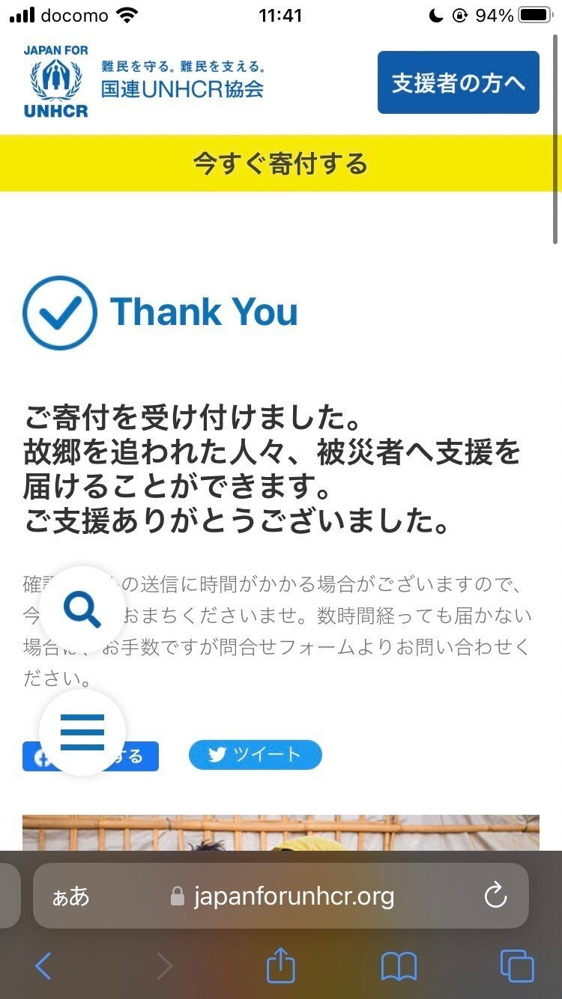
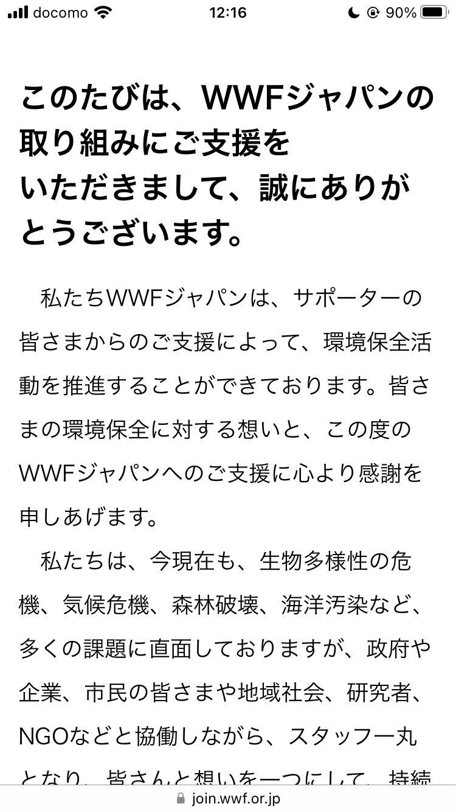

<figure>

</figure>

## ヒューリスティック

### AHC020

6/11にAHC020がありました。50位でした。

[https://twitter.com/hari64boli64/status/1667841682359062529](https://twitter.com/hari64boli64/status/1667841682359062529)

焼き鈍しはすぐ見えて、最適化対象の変数に二つ候補があるうちのどちらを選ぼうか悩み、結局筋の悪い方を選択してしまいました。  
スコア関数の観察から方針を決めることがどうにも苦手です。

とても面白いコンテストでした。

### AHC021

6/25にAHC021がありました。130位でした。

[https://twitter.com/hari64boli64/status/1672917870584680448](https://twitter.com/hari64boli64/status/1672917870584680448)

dpを用いる方針、言われてみれば確かにとなりましたが、焦っている時にそれに気づくのは難しいですね……  
努力不足を感じます。

オンサイトがかかったコンテストだったのですが、それにはいけるようなので、本戦を楽しみたいと思います。

### トヨタ自動車プログラミングコンテスト

6/8にトヨタ自動車の実課題プログラミングコンテストの賞金が来ていました。ありがとうございます。

<figure>

</figure>

<figure>

</figure>

ラクダよりは体を小さくして針の穴を通れるようにしたいです。

## ICPC

友人に誘って頂き、チームHxHxHでICPCに出ることになりました。

チーム名、ハンターハンターに由来するらしいのですが、私が「最近連載再開したし、縁起の良い名前だね!」と言ったら、友人から「いや、また休載(に近いこと)になっているから」と指摘されて思わず苦笑いしました。(冨樫先生のご健康をお祈りしています)

最近、それなりに練習や考察もしているので、何とか7/7の大会では5完したいです。頑張ってきます。

## その他

最近の面白いことは、守秘義務の関係上、殆ど全てが公には言えないことばかりです。  
  
そろそろ言えるようになる日も近いと思うのですが、早く色々書き連ねたいなという思いでいます。

そういった訳で、今月の月記は以上です。  
お読み頂きありがとうございました。
