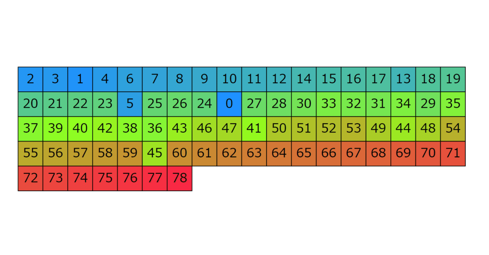
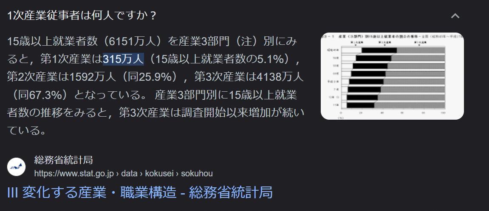

<figure>

</figure>

## 院試

今月は院試がありました。その内、それについて記したnoteを公開しようかと思います。開示があるのが10月なので、その頃になるでしょうか。

そしてそれ以外に特にイベントがない一カ月でした。

## 競プロ

TOYOTA Programming Contest 2023 Summer finalに出場して、82位でした。うーん、微妙。折角オンサイトに行けたのに残念な結果でした。

<figure>

<figcaption>

Seed=1のビジュアライズ結果

</figcaption>

</figure>

難しかったです。

## 本

今月も小説や漫画や参考書など、色々読んだのですが、『透明な夜に駆ける君と、目に見えない恋をした。』が特に面白かったです。GA文庫大賞の大賞受賞作らしいのですが、確かに素晴らしい作品でした。

これを読み終わった後、感化されてちょっと点字を勉強しましたが、あれは難しいですね。自宅のお風呂場にある乾燥機の操作パネルの点字をようやくなんとか解読して、おぉとなっていました。  

* * *

  
最後に、これまでの話とは全然関係のない話をして終わろうと思います。

突然なんですが、日本の第一次産業従事者数は何人くらいだと思いますか?

日本の人口が1億3000万人くらいなので、最低でも1000万人くらい、日本の産業形態も鑑みると、1/3よりは少ないはずなので、ざっと2000万人くらいでしょうか。

答えは315万人です。

……マジ???

<figure>

<figcaption>

驚愕の事実

</figcaption>

</figure>

これを偶然知った時はさすがに驚きました。これを読んで下さっている方の感覚には合致する事実だったでしょうか。是非感想を聞いてみたいものです。

よく音楽で300万回再生とかってありますが、数字としてはそれと殆ど同じ程度なんですね。本当にびっくりです。

画像にもありますが、就業者数が6151万人扱いなので、それも踏まえると約20分の1くらいだから、まぁそんなものかと言われればそんな気もしますが、しかし、それにしても少ないのでは、と思います。

最近は処理水のニュースが毎日のように流れてきますが、第一次産業に従事されている方々には、そういった諸々も踏まえると、全く頭が上がりません。

ありがたいことです。
