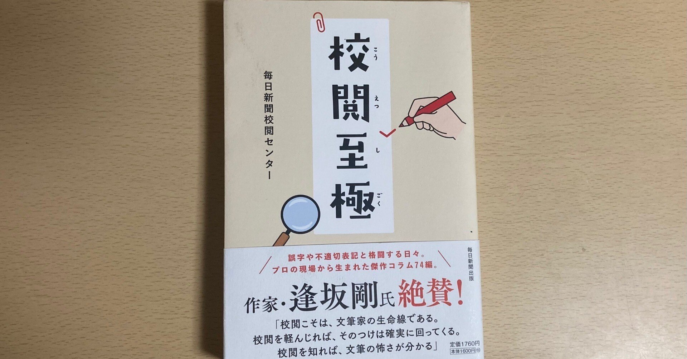
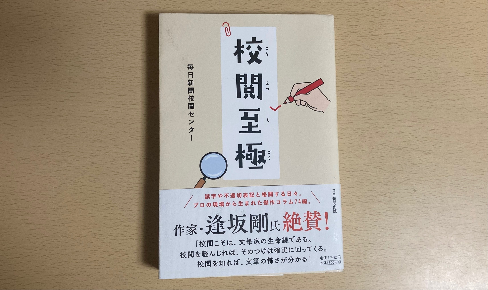
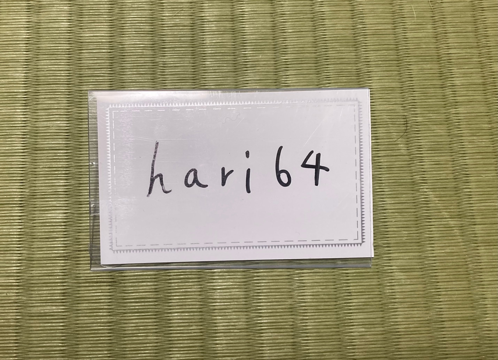
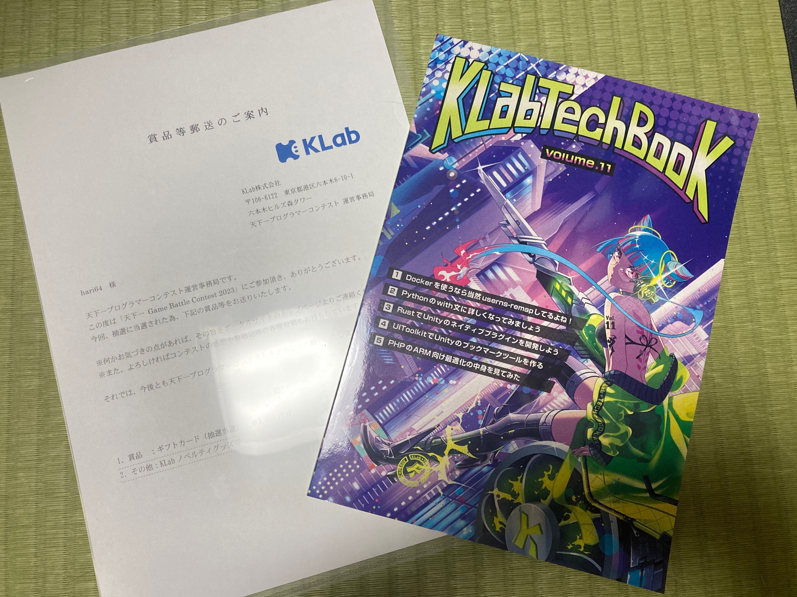

<figure>

</figure>

もう9月が終わってしまいました。

今月は某漫画内の先生が亡くなってしまったなぁと思いながら過ごしていたらいつの間にか過ぎ去っていました。

ただ、今月はやるべき事が多すぎて寧ろ疲労が溜まった気がします。夏休みは一体どこへ行ってしまったのか……

夏の思い出が一つもないように感じられたのですが、月記を書く為に色々整理したら思ったより出来事があったので、備忘録として記します。

## 本

今月は毎日新聞校閲センターの『校閲至極』を買って、今読み途中です。

<figure>

<figcaption>

『校閲至極』

</figcaption>

</figure>

自分が校閲を仕事にしているので買ったのですが、頷く点もあれば、全くの別世界が広がっていることもあり、読んでいて面白いです。

この手の本を既に何冊か読んでいるのですが、時々読者への挑戦のような形で誤りを含んだ文章が提示されます。  
私は大抵何個かミスを見落とすので、「自分校閲向いてねぇ〜」と頻繁になります。

まだ読み途中ではありますが、読んでいて特に感嘆したのは、「ロシア『本土』とクリミア半島」という節に、2020年時点で書かれた以下の文章です。

<figure>

> 見出しには「露本土とクリミア結ぶ鉄道橋完成」とついた。  
> ……本土？　手を止め、「本土」をペンで囲む。  
> （中略）  
> 読者の中には「本土」があっても気に留めない人もいるだろう。だからこそ大事なのだと思う。そうした人が意識せず「本土」とすり込まれてしまわないために。

<figcaption>

『校閲至極』

</figcaption>

</figure>

ここで重要なのは、クリミア半島がロシアの領土と考えるか否かです。  
もしそうでないと考えるならば、この表現は少しだけ、本当に少しだけ不自然です。

私は寧ろ、そんなことを気に留めない人間です。だからこそ、感嘆しました。  
世の中にはこんな「プロ」がいるのかと心の底から驚愕しました。

他にもハーフの人は日本に「来日」するのか？なども取り上げられ、言葉を生業とする方々のプライドや信念が窺い知れます。  
  
そんな信念を抱いて校閲をなさっている方々は、本当に尊敬します。

## 競プロ

### Asprova

Asprovaコンに参加して、17位でした。高順位！

[https://twitter.com/hari64boli64/status/1700828264695206109](https://twitter.com/hari64boli64/status/1700828264695206109)

　  
システスで順位が落ちたのが悔やまれます。大量テストケースでのチェックを忘れていました。  
  
懇親会も参加しました。以前アルバイトをさせて頂いていたので、存じ上げている方々も多く、楽しかったです。

出されたお肉が美味しかったです。

<figure>

<figcaption>

料理の写真を撮れば良かったのに、一枚もありませんでした。手元に唯一残っていた名札です。  

</figcaption>

</figure>

### 丸紅

[https://twitter.com/hari64boli64/status/1705895416779481513](https://twitter.com/hari64boli64/status/1705895416779481513)

こちらはもう少し上手く立ち回れたかな……

次の短期が楽しみです。

### 天下一

KLabさんから抽選の品が届きました。

<figure>

<figcaption>

アマギフも頂いて、そちらは食べ物になる予定です。

</figcaption>

</figure>

ありがとうございます！

### Sky

久しぶりに登校したら、学食にSky株式会社さんの懸賞問題（？）が復活していました。  
解いて提出したので、その内アイスか何かになって帰ってくると信じています。最近競プロのアルゴはWA頻発気味で少し怖いですが……

* * *

今月は以上です。

なんか殆ど競プロの話しかしていませんね。  
尤も、平常運転かも知れません。
