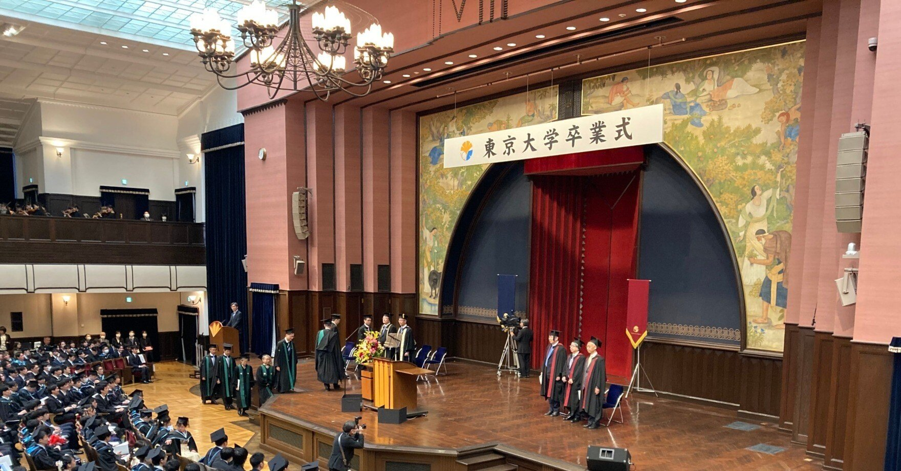
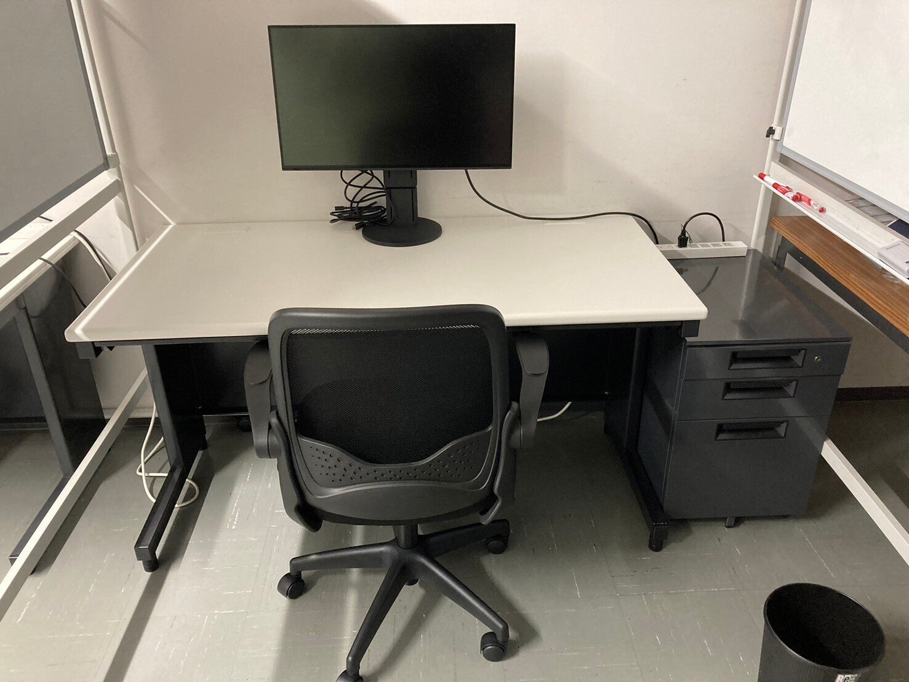
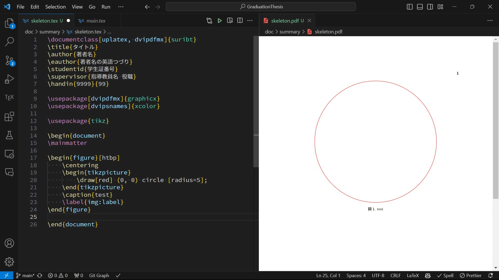
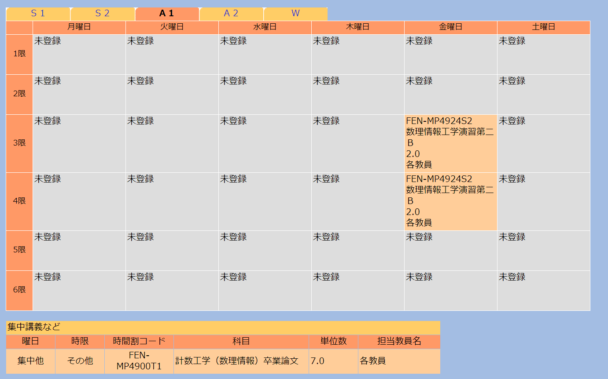
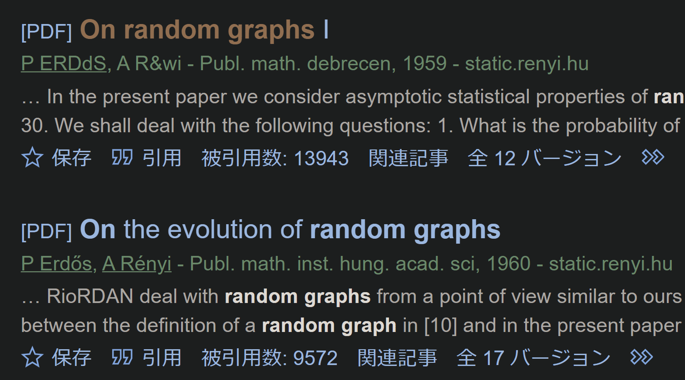
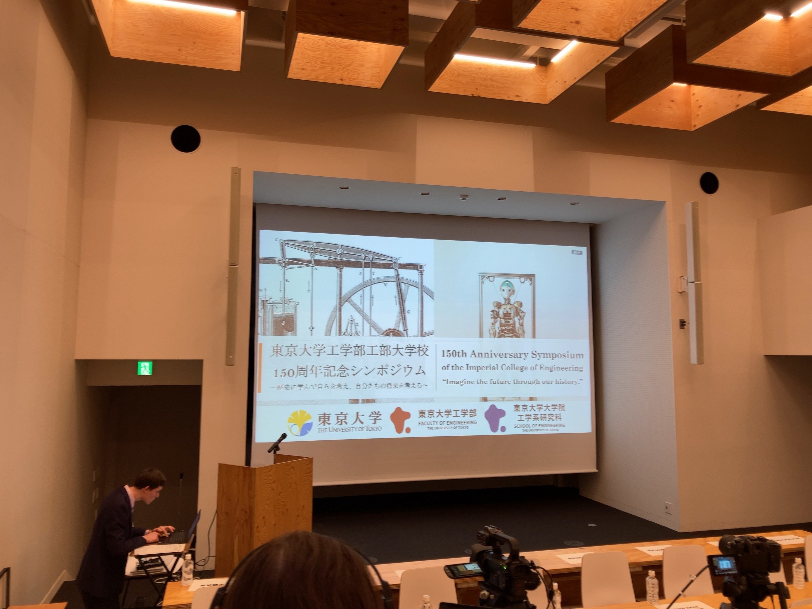
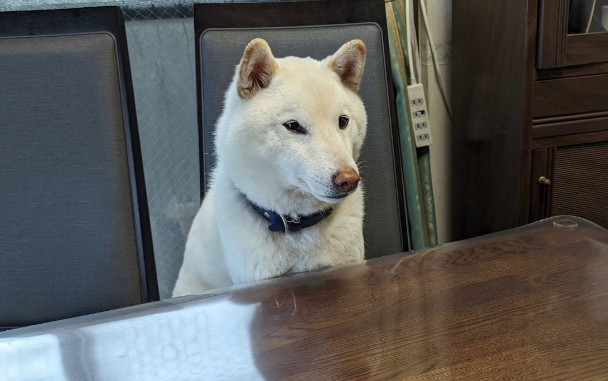

<figure>



</figure>

これは最近書くのをサボっていた月記のまとめです。そして同時に卒論にまつわる体験記でもあります。計数工学科に所属する私の卒論は、東大工学部の工学部長賞（研究）に選ばれました。ありがたいことです。

[https://twitter.com/hari64boli64/status/1771080579565465926](https://twitter.com/hari64boli64/status/1771080579565465926)

私の本名は2年くらい前から既に公開情報なので、というかすぐ上に書いてあるので、即座に私がどこの研究室所属でどの先生に師事したのかは特定できます。ただ、私がネットの海に放流した文章で研究室のご迷惑になるのは避けたいので、直接の言及は控えておきます。  
  
研究室における教授・准教授の方、助教の方々、博士の方々、とあるお一方を筆頭とする修士の方々、学科同期の方々、そして何より指導教員様には、非常にお世話になりました。  
  
いくら感謝しても到底しきれるものではありません。  
本当にありがとうございました。

## 9月

### 9月13日

院試が終わったこの頃、計数事務室から「卒業論文指導教員決定（内定）について」というメールが届きました。指導教員の決定は必ずしも事前に出した希望通りになる訳ではないらしいのですが、幸いにして私は第一希望の先生に割り当てられており、そして研究室で第一回の打ち合わせがあったので向かいました。

その日はSlackの設定などをした他、確かこの日に研究室での席も割り当てて頂きました。

<figure>



<figcaption>

私の席 （2月に撮影）

</figcaption>

</figure>

学生身分にしては非常に良い机と椅子、そして大きいパソコンとホワイトボードに囲まれていて最高でした。右下のゴミ箱は、ゴミ箱買わなきゃなぁ、とぼやいていたら同室の助教さんが貸してくれたものです。優しい。  
  
私は調子に乗ってこの後の一カ月間くらいで、電子機器類・卓上カレンダー・マグカップ・マドラー・スティックコーヒー・折り畳み傘・ティッシュ箱・クイックルワイパー・お掃除ブラシあたりをこの部屋に持ち込みました。こうやって列挙してみると流石に私は持ち込みすぎてて馬鹿ですね。でも快適でした。

### 9月20日

残念ながら詳細は憶えてはいないのですが、どうやらメールやSlackの履歴によると、この日に私の研究テーマは決まったようです。尤も、その研究テーマは最終的な研究テーマとは少し異なるものでした。頂いた文献を読みながら9月はダラダラと過ごしました。

なお、テーマは他にも3つ提示されており、その中から1つ選んでねという形式でした。合計4つのテーマはどれも興味関心のある話で、その内の一つは私が先生に雑談で話した内容と酷似したものだったので、特に心が揺れ動きました。ただ、最終的には別のテーマを選びました。

また、新規性を出すことが卒業の必須条件ではないことを伝えられました。当然と言えば当然です。基本的に卒論は出せば卒業できます。まぁ新領域の修士の方では[例外](https://twitter.com/syuu_dao/status/1760985045366710479)もあったようですが。怖い。

ちなみに、私の学科である計数は数理とシステムにコースが分かれていますが、私の知る限りにおいて数理の全ての研究室とシステムのほぼ全ての研究室は、これと同じ方式で卒論の研究テーマを決定するようです。ですが、システムのとある友人はこのような提示が無く、自分でテーマをゼロから見つける必要があったらしいです。それは中々に大変だと思いますし、というか私はそれで卒論を書き上げられる気が微塵もしません。実際彼からは卒論がかなり大変だという話を1月あたりに直接聞きました。

## 10月

この月は最終的な研究テーマとは関係の薄い話をやっていました。離散最適化に関連したある手法などを勉強していました。

いくつかの数値実験用のプログラムなどを書いてはいましたが、最終的にそれらは全てゴミ箱行きでした。10月11日にどうやらmain.tex（卒論本体のLaTeXファイル）を作成していて、卒論、というかメモを書き始めていたようです。しかし、この月に書いた内容の9割以上は最終的に捨てています。実質進捗は0ですね。

### 10月4日

この日が研究室セミナーの初日でした。噂には聞いていましたが、セミナーは英語で少しびっくりしました。ただ、英語だったのはこの日と他数日のみで、多くの日は日本語でした。色々な方の話をフンフンと聞いていました。

### 10月18日

この日も別の博士の方によるセミナーがありました。それが特に面白く、今でもよく内容を憶えています。数理的な詳細はあまり追えてはいませんでしたが……

ところで、この博士の方とはその後も何度かお話 or 一方的にお見かけする機会があり、とても感謝しているのですが、ある時「スターウォーズが好きなの?」的なことを訊かれました。スターウォーズのR2-D2の図面が書かれた白黒の服をよく私が着ていたからです。その服をよく着ていたのは純粋に手持ちの服が殆ど無かった為であり、かつ私は映画を一編も見ていなかったので「いえ、全くです」と思わず否定してしまいました。

後日、その方のTwitter（現X）のアカウントを発見しフォローしたのですが、プロフをふと見るとそこには"fan of Star Wars"と書かれていました。  
  
やらかしました。すみません。  
いつかスターウォーズの映画は見ておこうと思います。

### 10月27日

このnoteに書きましたが、RA(Research Assistant)のバイトの一環として、京都に行き第10回QS研究会で発表しました。

[https://note.com/hari64boli64/n/n7ce905bd8ccf](https://note.com/hari64boli64/n/n7ce905bd8ccf)

発表内容はこの論文です。

[https://arxiv.org/abs/2311.01362](https://arxiv.org/abs/2311.01362)

この約2カ月後の12月19日に数理最適化アドベントカレンダーに参加して、その内容を書きました。卒論の忙しい時期に労力を払って頑張って書いたのに、全然読まれなくてウケです。面白い内容だと思うんだけどな……

[https://qiita.com/hari64/items/2cb676862149802add11](https://qiita.com/hari64/items/2cb676862149802add11)

ちなみに最近これで優秀発表賞を頂きました。やったぁ。

この賞は（というかこの論文は）大半が共著者である先生と友人のおかげですが、私も私でこの手の話では運がかなり強い方だと思います。

## 11月

この月もダラダラと研究は続けていました。途中で研究テーマは変わりました。どちらかと言えばすり替わっていたという感じですが……

その新しいテーマで色々考えて、とりあえず複数ある問題のうちの一つは解けたつもりになりました。

その後に指導教員様としたミーティングで「あとはこういう問題もあるんだよね」という話を聞き、「じゃあこうすればどうですか」と提案したら、自分が読んでいた別の先行研究と合わせてその時点で問題はほぼ解けました。進捗万歳。

### 11月28日

Gitの履歴を見ると、この日に中間発表用のスライドは一旦完成したようでした。都合上12月の出来事も書いてしまいますが、その後の12月1日に研究室で中間発表練習をしてボコボコにされた後、スライドを手直し12月8日の中間発表に臨みました。  
  
他の方々の発表を聴いて、皆凄いことをしているなぁとしきりに感心するばかりでした。私は自分の発表で飛んできた質問に上手く答えられませんでした。散々です。

* * *

以下、少し鬱屈とした話が続きます。

実はこの頃、特に11月後半辺りは、色々と限界が来ていて中間発表が終わったら研究テーマを変えたい（正確には戻したい）と思っていました。絶対に勘違いされたくないので強調しておきますが、以下の話は己の無知と無学と無力と無能だけに依るものだと断っておきます。  
  
この月の後半は主に三つ目の問題の証明に取り組んでいました。この問題は詳しい経緯こそ知らないのですが、とある修士の方も過去に取り組まれていた問題で、その頃から未解決のものでした。この修士の方には本当に非常に良くして頂いて、それはもう大変お世話になったのですが、この方のほうが自分よりも頭が良いので、まぁ解ける気はそもそもあまりしていませんでした。

実際に取り組んでみると、想定を遥かに超えて一切解ける気がしません。この問題自体は、執筆現在においても未解決です。証明はほぼ不可能だと思っています。

そして、これがただ単に難問であるだけならばまだ良かったのですが、いくつかの勘違いも合わさって最悪の精神状態を作り上げていました。

この問題は主張内容こそ中学生当時の私でも理解出来るような簡単なもので、かつ数値実験の結果から帰納的に考えるに極めて自明なのですが、証明だけが地獄のように難しいというものでした。その為に「真偽自体は殆ど明らかであるその問題を膨大な労力を払ってまで証明することに、一体何の意味があるのか、興味の無い素人の目からすれば1mmも分からない」という状態に私は陥りました。

工学部長賞を獲っている時点で察せられるとは思いますが、当然、この問題の証明には極めて重要な意味があります。しかし、今でこそ私は問題を解くことの意義を大いに語れますが、当時は貰った参考文献の読み込みが甘く、それがきちんと分かっていませんでした。

また、私は実用と結びつくような離散最適化がしたくてこの研究室に来たという経緯がありました。先ほど勉強したと述べた「とある手法」などはかなりそうで、それ故にこのテーマを選んでいました。しかし、11月の冒頭でも述べた通りテーマが少し変わり、最適化と関係が無くなってしまったという「勘違い」をしていましたし、実用的な問題に対する証明ではなくなってしまったという「勘違い」もしていました。先行研究に対する無知と無学がもたらした結果です。  
  
結果としてやる気が完全に地の底にまで落ちました。

更なる追い打ちとして、10月と11月にかけて取り組み解けたつもりになっていた一つ目の問題に対する証明が完全に誤っていたことにも気付きます。15頁近い内容がゴミ箱行きです。気付いた時は流石に退学したくなりました。

私は高校時代から∀や∃に対する認識や、"any", "all", "every"あたりの語に対する認識が怪しかったという自覚はあったのですが、先行研究の読み間違いにより、それをやらかして完全に無駄な時間を過ごしました。無力と無能がもたらした結果です。

どちらにおいても、先行研究に対する読みの甘さが事態の悪化を引き起こしました。これは今でも深く反省し後悔しています。他大や他学科などと比べてこの学科における卒業研究の期間は非常に短いこともあってか、焦りすぎていました。まずは何よりも先行研究に対する正確な理解が重要であると学びました。

あんまりにも状況が地獄だったので「🔍卒論 研究 行き詰まったら」などと検索してはみましたが、実験の話ばかりがヒットしました。私の卒論は実験や実装ではなく理論がメインです。数理においても完全に理論ばっかりの人は少ないと思っていますが、それが世間一般においては殊更です。証明出来るか出来ないかの二択を迫られるだけだった私には何の役にも立ちませんでした。

そしてつい「研究テーマを変えたいのですが」と指導教員様にポロっと言ったら、この時点で進捗は出てはいるし、それは止めた方がいいという旨のことを言われて引き下がりました。結果論から言えば、それで非常に良かったと思います。

## 12月

これまでの話で合計3つの問題が出てきましたが、その内の一番の難問は一旦蓋をして見ないことにし、残りの2つについて卒論を書き進めていました。その3つが合体すると、最終的にある定理が示せて嬉しいという感じなので、いつかはその難問もやらなければならないというのが極めて憂鬱ではありました。

指導教員様による強力な助言のお陰で、割とこの辺りはすんなり進んでいきました。年末年始にやることも無かったので、家族に感謝しながら落ち着いて筆を進められました。

特に、3年次の12月頃に私が書いた以下の話の一部が、かなり直接的に研究に役立ってくれたので、こういうのは書いておくものだなぁとも思っていました。

[https://qiita.com/hari64/items/333dbff8f8b8fccdeb2c](https://qiita.com/hari64/items/333dbff8f8b8fccdeb2c)

ただ、私はQiitaしかりnoteしかり、ラフな口語調の文章を書くのに馴染み過ぎて、指導教員様からはもっと文語調で書けと叱られました。仰る通りだと思います……

そもそも私は日本人失格過ぎて文語調と口語調の区別があまり付きません。日本語のインプット自体が小説・ラノベ・緩い学術書にインターネットと偏っており、無から有は産めないものです。これは今後の課題です。

## 1月

卒論の提出日は2月2日なので、タイムリミットが約30日を切りました。最後に残った問題に取り組まなければなりません。

なんかもうどうしようも無いなと思っていたのですが、ある日、指導教員様からSlackが来て、「最終的に示したい定理の証明の為には、この問題を少し易化させても大丈夫なことに気付いた」という旨の連絡をもらいました。

突如として放たれた光芒に私は狂喜乱舞という感じでした。  
そうとなれば証明は自明です。万歳!

この頃にようやく研究テーマを本質的に理解したことも相まって気分最高になったのも束の間、数日後にはジェットコースターのどん底にまでまた叩き落されました。

私が「これは簡単に示せます」と言った、易化後の問題の証明に必要な補題の主張内容それ自体に誤りが発覚した為です。そしてそれは他の殆ど全ての部分を、その補題の成立を前提にして書いた後に分かりました。

これではどっからどう考えても退学です。  
卒業出来ませんが???

この後の数日間が本当の地獄でした。11月のそれよりも更に凄惨な悲惨な地獄です。そもそも証明が終わらなかったらどうすべきだったのか、何の案も無かったので本当にヤバかったです。指導教員様の方では易化した問題に対して（私は理解出来ませんでしたが）何らかの解決策を持っていらっしゃるようだったので、保険はあった気がしていますが。

結局なんやかんやあって、1月31日になってようやく証明は完全に終了しました。この時はまだ達成感など微塵も無く、ただただ疲労感だけがありました。

## 2月前半

### 2月2日

卒論提出日です。自分はこの日の割とギリギリまで書いていましたが、もう少し余裕をもって提出している人の方が多いようにも感じました。

解放感に浸るのも束の間、自分はギリギリまで粘っていたので、丁度一週間後に卒論審査会が迫ってきてしまいました。スライド作成をしなければなりません。自分の場合、中間発表よりもかなり内容が変わったので1から作り直しでした。

### 2月5日

研究室で発表練習がありました。ボコボコにされました。  
一般論として、研究で用いた専門用語は、特段の必要が無い限り全て一般的な語で置換できるならば置換した方が良さそうです。定理の主張内容も、数学的な厳密性を損なわない範囲内においてより分かりやすく書き換えるなど、そういった工夫をしていました。

### 2月7日

卒論審査会の開始日です。友人なんかは自分よりも2日早いこの日に発表をしなければならず、大変そうでした。

### 2月8日

前日に発表が終わったばかりの友人にスライドを送り付けて、修正点を指摘してもらいました。非常に重要な指摘ばかりしてもらってありがたい限りです。特に自分が図に使っていた細い線はプロジェクターに投影させると見えなくなる可能性があると指摘してもらって助かりました。

### 2月9日

卒論審査会の日です。

教室に入ると63号教室の前3列に教授たちがぎっしり詰まっている光景が目に入ります。待機時間はずっと胃が痛かったです。胃の半分が無くなりました。  
友人に「あれはもう存在自体が一種のパワハラだよね」と言ったら「それはお前が怒られろ」と言われました。それはそう。

発表はほぼ9分ピッタリで終わらせられました。

その後の7分間の質疑では、  
「Xと言った時に、それは何を意味しているのか」  
「条件Aを示すより条件Bを示すのが難しいと言っていたが、それは何故か」  
「この仮定Yは普遍的な仮定なのか」  
「この問題Cに関する具体的な応用例は何か」  
「何故Zの話が出てきたのか」  
などを尋ねられました。  
幾つかは想定していなかった質問でしたが、まぁまぁ普通に答えられました。

[https://twitter.com/hari64boli64/status/1755781818371219765](https://twitter.com/hari64boli64/status/1755781818371219765)

これにて終了です。疲れました。

* * *

丁度区切りが良いのと、価値ある情報を求め読んで下さっている計数の後輩にあたる方々に対して、流石に内容がゴミ過ぎて申し訳ない気がしてきたので、箸休め程度にここでいくつかお役立ち情報的なものを載せておきます。

⓪ 参考文献はよく読みましょう。本当に。これは自戒でもあります。

① 卒論のLaTeXファイルはupLaTeXでコンパイルする必要があります。私はLaTeXにあまり詳しくないのですが、以下のようにすると良かったです。

[https://twitter.com/hari64boli64/status/1739977961791779301](https://twitter.com/hari64boli64/status/1739977961791779301)

② TikZを用いた場合のコンパイルに手こずる方が何名かいらっしゃるようでしたが、こうすると良いです。

<figure>



<figcaption>

TikZを用いた場合のコンパイル方法

</figcaption>

</figure>

③ 卒論は履修登録する必要があります。私は気付かず留年するところでした。尤も、1月29日あたりにその救済措置があるということを知らせるメールが全員宛に来ていました。

<figure>



<figcaption>

下側の集中講義などの欄に出てきます

</figcaption>

</figure>

④ 参考文献の書き方について、私は特に指導教員様の手を煩わせてしまいました。個人的に学科全体の授業か何かで伝えておいて欲しいと思ったのですが、私の記憶の限りではその辺り何も知る機会が無かったように思えます。会議名などの略語を必要に応じて直したり、著者名の大文字小文字が混ざらないように注意したり、色々と指導を受けました。特に、たとえ引用数1万越えの非常に有名な論文であってもGoogle Scholarが壊れていることがあるということには驚きました。注意が必要なことだと思います。

<figure>



<figcaption>

Google Scholarの検索結果 著者名に注目すると、本来は下のようにP Erdős, A Rényiとなるべきですが、上ではP ERDdS, A R&wiと壊れています。古い論文だと自動生成の結果こうなりがちだそうです。

</figcaption>

</figure>

⑤唐突に強い思想を述べると、私は日本語文章中のカンマピリオドに対して強烈なアンチなのですが、あまり客観的ではない話をしても良くないので、以下のツイートを引用するにとどめます。

[https://twitter.com/sei\_shinagawa/status/1753328131220636084](https://twitter.com/sei_shinagawa/status/1753328131220636084)

「、。」での論文執筆は許されなかったので、私はbashで全てのファイルをtempフォルダに移してから

```
sed -i -e 's/、/，/g' -e 's/。/．/g' doc/summary/temp/*.tex
```

をしていました。環境構築が上手な人は[latexindent](https://gist.github.com/Yarakashi-Kikohshi/825806b681d0f1b4c72a6a36860d4568)を上手に使うなどすると良さそうです。  
  
私が提供できるような情報は高々この辺りでしょうか。

* * *

では、以下に残りの2月と3月の話を書いていきます。  
卒論の話よりも日常の話が主です。

## 2月後半

審査会が終われば実質春休みです。  
審査会の日の午後は友人達と控室でカタンをしました。楽しかったです。

### 2月13日

計数システムの人たちの卒論審査会の日でした。数理は3日間ありますが、システムは1日のみらしいです。

気になっていたので、卒論テーマを提示されなかったと先述した、例のシステムの友人が発表するのをZoomで見ました。  
2月7日の時点で「『超音波フェーズドアレイ......あれ以上にアレイ状なものはないですよねw　ﾊｯﾊｯﾊｯ』→ 発表終了」とか言うツイートを公開垢でしていたので、大変失礼ではあるのですがこの人本当に大丈夫かなとはちょっと思ってはいました。  
  
実際に発表を見ると「これが**優秀な人間**というやつか」という感想になりました。

やっている事の難しさが素人にも分かるレベルでありながらきちんと新規性のある手法を提案した上で結果まで出しているの、シンプルにバケモンですか?  
あと、塾講師とかをしている方々は発表が上手ですね。聞いていてとても面白かったです。

全体的な話として、私が見た発表が特殊な可能性もありますが、他数件を見た上で判断するにシステムの発表の方が素人には理解しやすい気がしました。実際に行っていたデモなどが特に面白かったです。また、友人の言葉を借りると「（発表後の拍手の有無などで）文化の違い」を感じる点はありました。流石に民度の違いではないと思いますが、数理では私の知る限り全員が私服であったのに対し、システムではスーツの方が多かったなどの違いもありました。

### 2月16日

この日は指導教員様に呼び出されて大学に向かいました。そこで色々と研究にまつわる話をした上で、「事務から何か連絡は来ていない?」と聞かれました。この時に私は「あぁ、自分は工学部長賞を獲れたのだな」と確信した上で、実際に連絡は無かったので「いえ、特には」と答えました。

これだけで受賞を確信するというのは、客観視おかしな話で、何故そんなことを思ったのかは今でもよく分かりません。ただ恐らく、卒論の結果に対する漠然とした自信（これは自分に対する信頼というより、遥かに指導教員様の凄さに対する信頼です）と、そして私の豪運に対する矜持はあったのかと思います。

その会話以降、私はポーカーフェイスに努めましたが、どうにも気持ちがフワフワしてしまって、その後の研究の話はあまり頭に入ってきませんでした。

そしてこの日の夜には研究室の飲み会（追い出しコンパ）がありました。大学近辺のお店で皆さんと晩御飯を食べました。私はお酒を飲まないのでジンジャーエールを5,6杯飲んでいました。流石に飲み過ぎで気持ち悪くなりました。バカかな？  
  
あまり直接的な関係を持たなかった先生とも色々とお話が出来て楽しかったです。

### 2月19日

この日までの10日間、THIRD プログラミングコンテスト2023（AtCoder Heuristic Contest 030）が開催されていたので参加しました。  
卒論から解放されたので最適化し放題です。楽しい!  
  
結果は暫定6位、最終8位でした。一部計算方法に見落としがあって、少しだけ悔いは残る結果でした。

[https://twitter.com/hari64boli64/status/1759522213689278746](https://twitter.com/hari64boli64/status/1759522213689278746)

そしてこういう記事も書きました。後日友人に聞いたら、この記事で「私は初めて知りました」と書いてある事柄を、どうやら応用統計学の授業で扱っていたようです。うーん、退学。

[https://qiita.com/hari64/items/a7793a7071b4015ef92c](https://qiita.com/hari64/items/a7793a7071b4015ef92c)

ところで、前々から思っていたのですがこの界隈、良い意味でヤバすぎる人が多すぎます。ある人は情報系の出身じゃないのに（実質2,3週間程度で）私より深く情報理論を理解した上でこのコンテストを優勝していますし、ある人はいわゆる普通の主婦のような方なのにコンテストの解説放送で相互情報量の話に相槌を打っていました。この人たちは一体何なのですか?  
凄いものです。

### 2月22日

この頃は毎分のようにメールアプリを開いて頻繁に更新をかけていました。そしてついに待望の連絡が来ました。工学部長賞確定です。やったぜ。  
家族に報告したら喜んでもらえました。

### 2月23日

突如として全然関係のない、どうでもいい日常の話をしますが、私は倫理・政治経済などの模試の校閲バイトをしていて、この日もその仕事をしていました。そして以下の2つの指摘が出来ました。

1\. 「ー（伸ばし棒）」と「―（ダッシュ）」の違いの指摘  
2.  "P（半角大文字）"と"Ｐ（全角大文字）"の違いの指摘 （noteのフォントだとかなり分かりやすいですが）  
  
特に1番のは前から指摘してみたいと思っていたのですが、そもそも違いを見つける以前に、そういう誤植がないと指摘は出来ません。なので確実に運が回ってきています。今まで地獄だった日々を送ってきた自分に対するご褒美でしょうか。人生最高。

あと自分は「へ（ひらがな）」と「ヘ（カタカナ）」の違いの指摘をするという実績解除が目標です。見つけられる気は微塵もしません。

### 2月24日

スライドを見てくれた友人に卒論本体も送り付けていたのですが、それに指摘をもらったので反映しました。無駄に長い76頁の卒論を読んでくれて、本当にありがたい限りです。  
  
これが読まれるかどうかは分かりませんが、貴方の名前は謝辞に入れさせて頂きました。どうもありがとう。

また、ABC（競プロ）に久々に出てボロボロの結果でした。  
流石にちょっと不味い。

この数日前、とある授業の演習でTAをやってくれないかという依頼が大学側から来ていました。TAはこちらか応募するものだと思っていたので、向こうから依頼が来るとは意外でした。やりますとは答えたのですが、その授業は実質競プロです。つまり、ヒューリスティック系のコンテストではなくアルゴリズム系のコンテストの能力が求められます。私はアルゴがかなり苦手です。何で自分にこの依頼が来たんだよ……

どうにかして秋までに黄色復帰したいです。

## 3月

### 3月4日

JSIAM 日本応用数理学会による[第20回研究部会連合発表会](https://jsiam.org/union2024/)で発表する為に新潟県の長岡に行きました。この学会への出席は12月辺りに指導教員様から持ち掛けられたはずです。楽しかったです。詳細は以下にあります。

[https://note.com/hari64boli64/n/n85661f9ccb0c](https://note.com/hari64boli64/n/n85661f9ccb0c)

この記事にも書きましたが、私の前の発表者が先述した修士の方で、私の発表でも用いた理論の基礎部分を非常に分かりやすく説明して下さり、完全にフリーライダーでした。

私の発表は2日目の午前にありました。待機時間はずっと胃が痛かったです。胃のもう半分が無くなりました。胃の消滅。  
  
他の方の発表も多く見ましたが、色々と面白かったです。ただ、体裁に関して、明らかな誤字脱字や崩れ・詰め込みすぎて米粒サイズになった文字・がさつな私でも気になるレベルのスタイル不統一など、粗の目立つ発表が年上の方でもそこそこありました。あとは声が小さくて何を喋っているのか聞こえないとか、スライドの前に立ってしまってプロジェクターからの光を全身に浴びてしまっているなどもありました。  
  
内容の凄さは私に計りきれるものでは無いですが、少なくともこの体裁に関しては、学科同期達による卒論審査会の方が上だったなぁと思いました。

### 3月8日

[工部大学校150周年記念シンポジウム](https://www.u-tokyo.ac.jp/focus/ja/events/z0104_01354.html)にお呼ばれしたので参加しました。工学部の歴史の話や修士の方による講演などを聴いてきました。

<figure>



<figcaption>

シンポジウムの様子

</figcaption>

</figure>

工学部長賞を獲った人達は事前にスライドを提出しており、30秒くらい画面に映し出され表彰される訳ですが、そこに趣味の写真を載せていいよと書いてあったので愛犬の写真を載せました。そしたら皆さんは研究の写真しか載せていなかったので、かなり浮きました。話が違う!

<figure>



<figcaption>

ちゃっかり食卓を囲む愛犬

</figcaption>

</figure>

まぁこの子の可愛さをお伝えできたのでokです。

ところで、今年の工学部長賞（学修）の最優秀は私のとある友人でした。彼のUTASを過去に見せてもらいましたが、想定よりもヤバくて笑えます。具体的にどういう内容か言及することに本人の許可を取っていないので、ご想像にお任せしますが、逆にこれで最優秀でなければ世界が怖いという感じです。

この友人にUTASを見せてもらって以降、時々深夜にぼんやり、果たしてどういう立ち回りをすればあんな非現実的な結果を残せるのか考えてしまいます。私は工学部の2年間で54個の単位を取り、その内の約30%が良や可だった訳ですが、これ以上その数を減らせる気はあまりしていませんでした。最適化問題であまりに異常な最適解を見せられている気分です。  
  
発表をサボったとか課題で手抜いたとかがあるのは自明な改善点ですが、人間ならばまぁ試験でこの位のミスはするよね、という良や可もありました。しかし、それらも改善しなければ彼の結果にはまるで届きません。すると、当然の帰結として彼の結果に届く為には人間を辞めなければなりません。終わった。

彼はPCで例えるならば常人離れして完璧で高性能に鍛え上げられたハードの上に理路整然と沢山のソフトを有しているみたいな感じなのでしょうか。自分はバグだらけハードの上に飽き性由来の過多ソフトが存在しているみたいな感じの人間なので、比べると嫌になってきます。というか、嫌になりました。辛いので考察はこの辺で止めにします。

唯一幸いな点は、少なくとも私にとって彼が高校時代から一番仲が良い親友であるということでしょうか。彼が将来大成してお金持ちになったら、回らないお寿司でも奢ってもらうこととします。

### 3月22日

卒業式の式です。疎遠になっていた前期課程時代の友人など、懐かしい面々にもお会いしました。とても楽しかったです。

そして、冒頭の通り、この日に工学部長賞を頂きました。

以上です。

* * *

## 卒論を振り返って

最後に、少しだけあとがきのようなものを記しておきます。

私は学科の友人達と比べて、数学的能力とかプログラミング技能とか理論的思考力とか勉強量とかは劣りまくりの負けまくりな人間です。  
  
なので、なんでこんな人間が工学部長賞を頂けたのか、ということは感傷的に時々考えてしまいます。受賞に対する私の貢献は完全なる豪運だけに過ぎなかった、と結論付けるのは流石に悲しすぎますし、数理工学を修めた人間の推論にしては少々杜撰です。そこで、強いて要因を考えると、

1. 文章作成の経験（≒執筆経験 [Qiita](https://qiita.com/hari64)とかnoteとかRAでの論文とか）
    
2. 校正校閲の経験（≒模試校閲のバイト）
    
3. 図表作成の経験（≒お絵描き経験 [pixiv](https://www.pixiv.net/users/37004914)）
    

などが挙げられるでしょうか。これらの「能力」が人々より優れているとは到底思えませんが、「経験」だけならまぁまぁあるかと思います。1に関して言えばそういえば競プロの実課題コンにおける[サマリー](https://qiita.com/hari64/items/2ec50a8ccc5fbf405cee)で特別賞もらうなどしましたし、2に関して言えばこの記事中でもあえて触れましたし、3に関して言えば中高時代に漫画を描いたり小説を書いたりしていたことも思い出しました。うっ、唐突な黒歴史が……

痛々しい過去にはとりあえず蓋をするにしても、（研究テーマの特性上有利という背景もありますが）図表は学科の中で一番良かっただろうと思いますし、受賞に対する私の貢献度の内では大きな割合を占めているのでしょう。  
  
数年前に他界した[私の祖母](https://www.art-annual.jp/select-gallery/hamaguchi-miwa/)は画家で、とは言え私は祖母と芸術の話をしたことは一度もなく、またその作品を殆ど理解出来ず、更に言えば幼少期において美術的な技能は壊滅的だったという不孝者ですが、ある程度は顔向け出来るようになったのでしょうか。

これまでの人生、特に大学の4年間は、考え無しにダラダラ生きてきただけですが、自らの辿った軌跡を振り返り見れば、散々だったこの旅路にも何かしらの意味があったのかも知れません。

そんなことを思わせてくれる今回の受賞でした。

関わって下さった全ての方々に感謝申し上げます。  
ありがとうございました。
