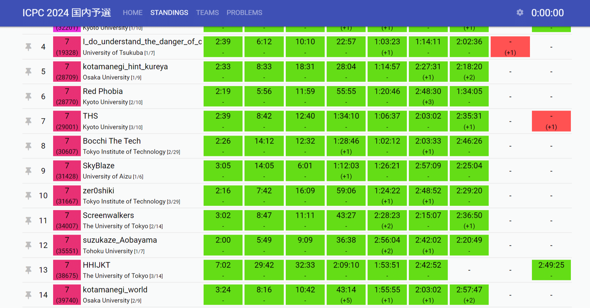
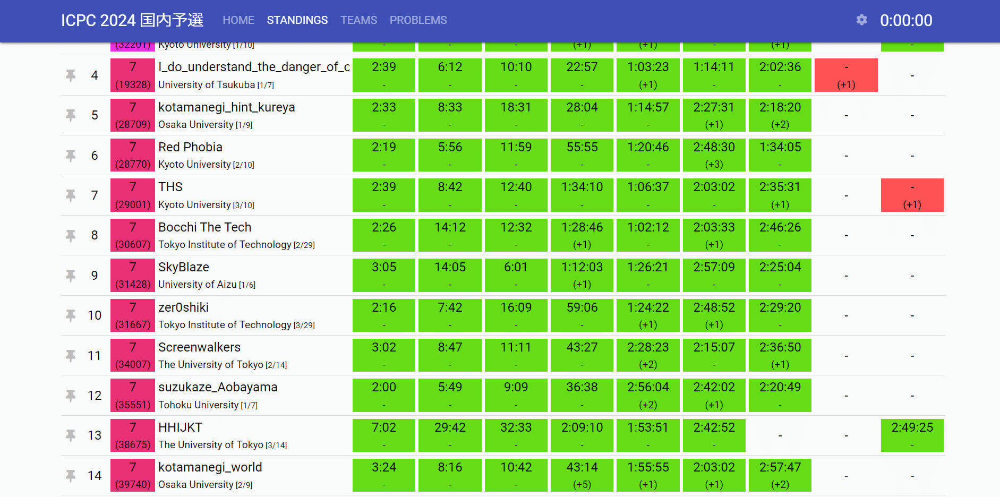
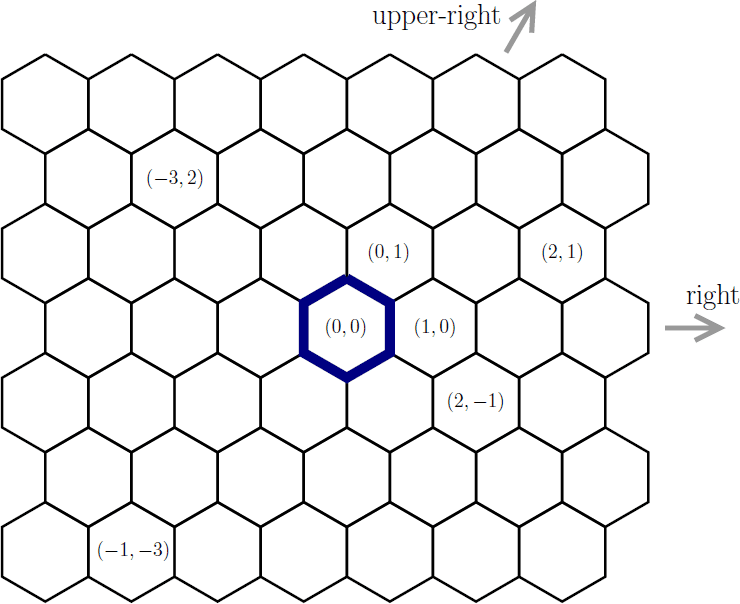
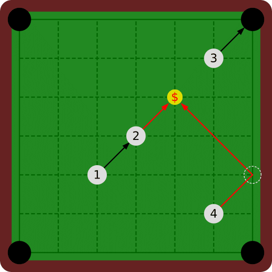
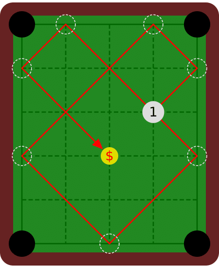
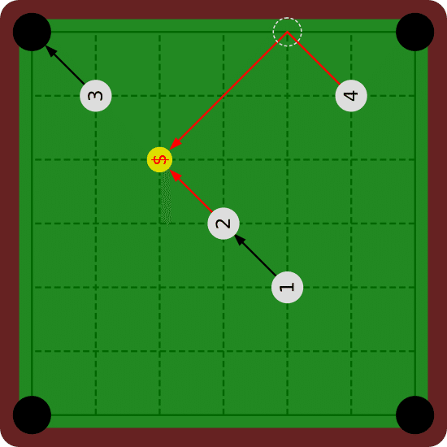
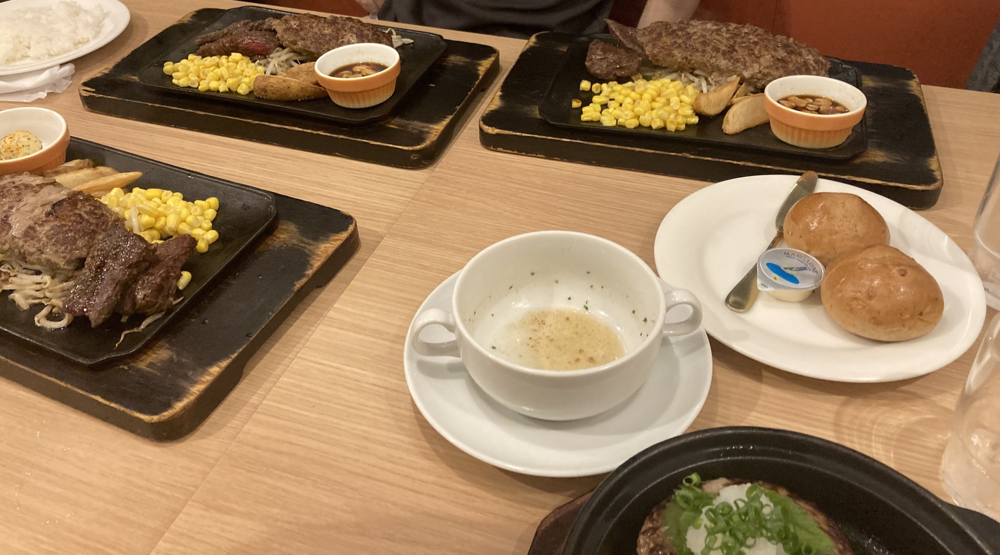
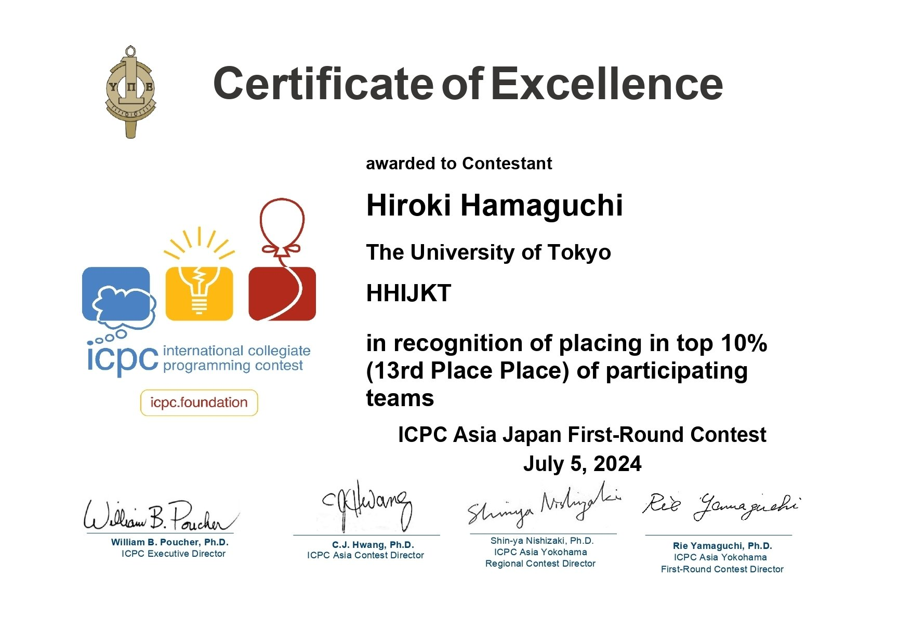

<figure>

</figure>

このような参加記は全く書く気が無かったのですが、確実に一生の思い出になりましたので、参加記を認めることにしました。

チームHHIJKTでICPC2024の国内予選に参加し、全体13位東大内3位だったので（何もトラブルが無ければ）予選を通過しました。

<figure>

</figure>

**※ この参加記は問題のネタバレをやや含みます。**

問題はこちらで公開されています。

[https://icpc.iisf.or.jp/past-icpc/domestic2024/contest/all\_ja.html](https://icpc.iisf.or.jp/past-icpc/domestic2024/contest/all_ja.html)

## チームメンバー

**kumjin3141** : 同じ研究室のM1同期 AtCoder黄色**  
mimirot** : kumjin君のサークルのB4の方 競プロ初めて1,2ヶ月程度らしいです**hari64** : 筆者 アルゴ引退気味 ヒューリスティックも引退気味 青に落ちてからずっと黄色に上がれていない()

チーム名のHHIJKTは3人のイニシャルをソートしたものです。読み方は決めていなかったのですが、他の方に「ハイジャックって読むんですか?」と言われてなにそれカッコイイみたいに思っていました。後付けで採用してしまおうかな。

## 5月

私はチーム内で唯一のICPC経験者で、昨年にチームHxHxHとしてHonjo\_Mapleさんとnoyesgoodmanさんのお二方と出ていました。この経験が無ければ今年はどうにもなっていなかったこともあり、今でも非常に感謝しています。

Honjo\_Mapleさんの方が昨年就職されたこと、悔いこそ残るもののそれなりに満足していたこともあり、今年は全く出る気がありませんでした。

[https://twitter.com/hari64boli64/status/1677285759731236867](https://twitter.com/hari64boli64/status/1677285759731236867)

しかし、5月になるとICPC宣伝用ポスターが研究室の前に貼られました。ICPCは酸っぱい葡萄と見做して傍観者になるつもりでいたのですが、研究室に通うたびに否が応でも目に入ります。逃れられない思い出となっているのも何かの縁かなと思い、kumjin君を誘って、足りないチームメンバーを募集してもらいました。

[https://twitter.com/opt\_misc/status/1794938703384814072](https://twitter.com/opt_misc/status/1794938703384814072)

結果として東大内のSlackで指定された期限を少し過ぎてからmimirot君が来てくれたので、大急ぎで参加登録しました。tokusakuraiさんがご対応なさってくれて、本当にありがたい限りです。ありがとうございます。

[https://twitter.com/tkskri\_kypr/status/1803082450547171511](https://twitter.com/tkskri_kypr/status/1803082450547171511)

## 模擬国内

mimirot君は予定が合わないそうでしたので、2人で出て34位でした。  
実際にこの位が実力相当だろうと思っていたのと、東大は例年10位以内に入らないと同校制限の為に勝ち進めないこともあり、「記念参加ということで気軽に行きましょう」ということは3人で共有していました。

そういったこともあり、通過確率は高々5％くらいだと思っていました。

## 予選当日

### 午前中

事前準備としてbashファイルなどを用意しました。私の数少ない貢献の一つです。東大の情報基盤センターから出場しましたが、そこにあるPCではなく、私のPCで出場したこともあり、環境構築の優位はあったかと思います。今年のルール緩和は本当に幸運でした。

<figure>

> また、サンプルプログラム、アルゴリズムの記述、開発環境の設定、作業用ディレクトリなどを競技に使用するマシンに前もって設置、準備し、競技中にそれらを利用して構いません。開発環境やその拡張機能などのソフトウェアを事前にセットアップして構いません。

<figcaption>

競技ルール/Rules

</figcaption>

</figure>

[https://github.com/hari64boli64/ICPC/tree/master](https://github.com/hari64boli64/ICPC/tree/master)

### 開始前

mimirot君が情報基盤センターの後方席をいつの間にか確保してくれていて、結果として一番広い机と一番早く印刷された問題を受け取る権利を享受しました。これが無ければ地味に危なかったかと思います。本当に感謝です。

飲み物が無くなったのでmimirot君と買いに行き、kumjin君にお茶を一本奢りました。「代わりに沢山問題解いてね」と冗談めかして言ったのですが、まさかこれが現実になるとは露知らず……

### 序盤

参加記念ということもあり、A,Bをmimirot君に解いてもらいました。印刷を待っている間、kumjin君が大学の課題の話をし始めて、マジ?と思いながら適当に聞いていたのですが、逆にこのくらいの緩さが良かったのかも知れません。

想像以上に印刷が遅くて15分くらいしてからようやく問題に目を通せ始めました。他チームは大きなディスプレイで画面分割して問題を見ていたので、賢いなぁと思っていました。

A,Bを書いてもらっている間、Cを眺めて考えていました。mimirot君に最初二問を頑張って解いてもらったお陰で時間を確保できたのは本当に大きかったです。自分は競プロ初めて1,2カ月でA,B通せるのか自信ないですね……

Cはとても簡単な問題なのですが、私はこういうのが大の苦手で、10分くらいかかりました。ハニカム構造に一個ずつ値を入れて確かめながら式を整理して、何とか答えを導けました。

<figure>

<figcaption>

問題C  
ハニカム構造にて座標が与えられる。中央からの最短距離を求めよ。

</figcaption>

</figure>

書いてもらったA,Bが無事通った後、Cを書いて通り、一安心します。  
ここまで32:33でした。

### 中盤

その間kumjin君がEとFを見てくれて、Eは難しいから飛ばそう、Fは簡単そうだからやろうという話になり、kumjin君がDの実装を始めていたと思います。

Fを見てすぐの感想としてはかなり簡単そうだなという事でした。

<figure>

<figcaption>

問題F  
全ての球に関して、それぞれ右上方向に打つビリヤードを考える。  
他の球に当たらずにコインを獲得できる球を全て答えよ。

</figcaption>

</figure>

<figure>

<figcaption>

なお、このような反射も考える。

</figcaption>

</figure>

ビリヤードが題材だったのですが、今にして思えば以前のチームHxHxHで打ち上げに行ったのもビリヤードだったので、妙な運命を感じます。

鏡像を考えてトーラスっぽく考えるのまでは自明で良いとして、愚直解は計算量が𝑂(𝑁²)になること、球同士の衝突判定が大変そうな事、実装があまりに鬼畜でどうにもならなそうことに気付き段々と絶望していました。

程無くして計算量の問題は球ではなくコインを4方向に突くようにすることで解決すると気付きます。また、球同士の衝突判定は一般化ユークリッドの互除法で解けることに気付き、詰まっていたDを奪って実装を始めました。

ただ、これがあまりに地獄でどうにもならなかったです。そもそも見落としがあって誤って簡略化しすぎた問題を解いていたのですが、それでも実装がキツい。

これは非常に困りました。

  

すると、横からmimirot君がEの本質的アイデアを出してkumjin君が解けそうと主張します。天才か???  
  
後から人に聞いた話によるとEは黄diffくらいあるらしいのですが、それを灰コーダーが実質的に解いてしまうとは……

衝撃的な報告を基に一旦PCを彼らに譲り、自分はもう一度落ち着いてFの実装を考えていました。

  

拡張ユークリッドの互除法を使うのがそれこそ去年のICPC以来なこともあり、そこでバグらせていたことに気付くと共に、自分にとって最も本質的な気付きである、盤面を回転させればコインを突くのも右上方向に固定できるということを発見しました。

<figure>

<figcaption>

4の球へとコインを動かすのに、元の盤面では右下に突く必要があるが、  
回転後では右上に突けば良い

</figcaption>

</figure>

このアイデアを思い出したことで実装はかなり簡略化し、どうにか形になりそうと気付きます。

ここまで交代しながら実装して、ついにkumjin君達がEを通します。ファインプレー。1:53:51でした。

その後更に交代しながら実装して、Dも通してもらいました。2:09:10でした。  
自分は完全に蚊帳の外でしたが、途中でデバッグ実行して配列外参照を指摘するだけのお手伝いをしました。  
私の一番の貢献は環境の整備だったのでは?

  

その後はずっとFを実装して、ようやく4方向にコインを動かした際に衝突し得る球の番号を手に入れることに成功します。最初の図で言うと1,2,3,4が出力として得られる状態です。  
  
ただ、これでもまだ足りておらず、最後にそれが本当に正しい向きでシミュレートされているかを確かめなければなりません。ここでもバグらせながら、ようやく2,4という解が手に入ります。やったぜ!

意気揚々と入力をダウンロードして実行させたのですが、そこで更に問題が。長いループが発生して実行が終わっていませんでした。  
  
割とここで心を打ち砕かれ、戦犯になる覚悟をします。デバッグ実行をしながらようやく問題を解決し、提出制限の6分が過ぎているかどうかも分からず震える手で提出を押しました。

Congratulations!

競プロ人生において、問題を通して思わず手を叩いてしまったのは記憶にない程です。近くの席の方には申し訳ないことをしました。ダメ元な提出だっただけに滅茶苦茶嬉しかったです。2:42:52でした。

### 終盤

残り18分程度となり、流石にもう解ける問題は一題も無いだろうとフワフワした気持ちで眺めていたのですが、何やらkumjin君がIが解けそうと言って実装を開始しました。

まぁ残り時間ないし、最終問題だし、計算量全然合ってないって言っているし、流石に無理だろうなと思いながら眺めていました。

するとサンプルがあったと報告されます。マジで???

提出するとAC。2:49:25と、わずか7分後の出来事でした。  
俄かには信じられないものを目にした気分で、茫然としていました。  
まさか奢ったお茶の伏線回収をされるとは……

Iが通った瞬間は11位で、よく頑張ったと思う一方、10位以内に入れないことは少し残念に思っていました。

しかし、よくよく見ると東大は上に2チームしかいません。  
「これって実は通過しているのでは?」とkumjin君が言います。  
私は選抜ルールを憶えていなかったので、逸る気持ちを抑えながら半信半疑で終わりの時を迎えました。

その後最速でICPCの選抜ルールを開き確認すると、自分達が通過したことが分かりました。歓喜の瞬間でした。

### 終了後

最終13位でした。tokusakuraiさんから我々が通過していると聞いてようやく実感が湧き、喜びを分かち合いました。

解散後はSPJなどのチームとステーキ屋に行ってハンバーグを食べてきました。特別に美味しかったです。

<figure>

</figure>

## 感想

まず、記念参加のつもり（特に私は予選通過できるとは微塵も思っていなかった）だったのに想定以上の好成績を残せて本当に望外の結果です。  
ひとえにチームメイトお二人のお陰と思っています。ありがとうございます。  
  
そして何か一つでも歯車が狂えばこの結果は無かったので、本当に幸運でした。私は自分の豪運に矜持があるので、そういった面では貢献できたかも知れません。

[https://twitter.com/dijkneko\_496/status/1809191777792041355](https://twitter.com/dijkneko_496/status/1809191777792041355)

[https://twitter.com/IzTakut74105/status/1809215213222445271](https://twitter.com/IzTakut74105/status/1809215213222445271)

その一方で、kumjin君の言う通りなのですが、他のチームの方々に対して、私みたいな純粋enjoy勢が通ってしまったことに幾ばくかの申し訳なさを感じます。最近はプログラミングこそ研究で使うので真面目に取り組んでいましたが、競プロは殆ど惰性で続けているに等しい状態でした。

[https://twitter.com/dijkneko\_496/status/1809283515730784502](https://twitter.com/dijkneko_496/status/1809283515730784502)

そもそもSPJという今年の学内1位チームとは学部生時代からの付き合いで、彼らを通してICPCの楽しさ・厳しさを見聞してはいました。  
特にその内の一人は高校時代からの友人で、天賦の才と努力の量が共に桁違いの人間であることをよく知っています。そういった人間でも落ち得るICPCは正に魔境だなと感じていました。

そんな中で東大のチームとして勝ってしまったからには、傲慢不遜で気取った言い方かも知れませんが、所謂「勝者の責任」を帯びるものかと思います。きちんとその責任を果たせるよう、横浜に向けて準備をしていきたいと思います。

  

また、ICPC終了後には、上位10チーム内に東大が1チームしかいないから弱くないかという話を各方面から聞きました。聞いた当初は（私が「弱い」の代表例であると思いますし）ムッとしたものの、客観視するとあながち間違いでもないのかも知れません。私たちが今回通過できたのも同校制限に引っかからなかったからというのが一番大きな理由です。

長い間、東大に競プロサークルが無かったことも災いして、そういった文化が徐々に失われてきているのかとも思います。尤も、最近ようやくサークルが出来たらしいとは伺いましたし、B2で出場しているチームとも帰りの電車でお会いしました。

私は次の横浜でどう足掻いてもICPCは最後ですが、来年以降、彼らが大学全体を再び引っ張っていってくれることを僭越ながら期待しています。

  
ともあれ、まずは自分が責任を果たすところからでしょうか。  
悔いの無いように横浜大会に向けて頑張りたいと思います。  
ありがとうございました。

* * *

［追記］  
賞状を送付してもらいました。

<figure>

</figure>
