<figure>

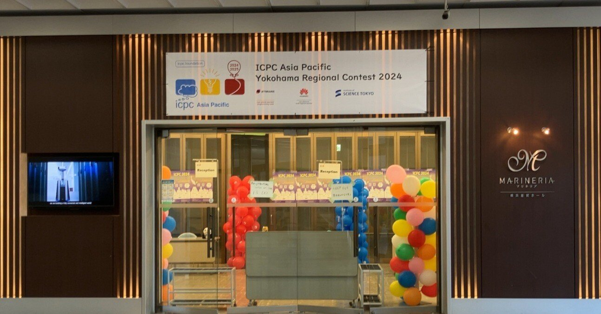

</figure>

## 学業

### Initial Placement for Fruchterman--Reingold Force model with Coordinate Newton Direction

論文を書きました。大変でしたが、特任助教さんには本当に大変お世話になりました。尤も、自分のムーブが色々良くなかったなぁと思い続けているので、次回はもう少し楽しんで研究をしたいですね。

[https://arxiv.org/abs/2412.20317](https://arxiv.org/abs/2412.20317)

研究室内で発表もしたんですが、もう少し英語の発音というか、どもりがどうにかならんのかと思います。11/29に必修の輪講として発表した際はもう少しマシだった気がしたのですが。  
スライドはここにあります。Unable to render code blockと出るかも知れませんが、Download raw fileすれば見られます。GIF埋め込みなどをしたので満足でした。

[https://github.com/hari64boli64/Initial\_Placement\_for\_Fruchterman-Reingold\_Force\_Model\_with\_Coordinate\_Newton\_Direction/blob/main/doc/presentation/presentation.pdf](https://github.com/hari64boli64/Initial_Placement_for_Fruchterman-Reingold_Force_Model_with_Coordinate_Newton_Direction/blob/main/doc/presentation/presentation.pdf)

### 硬貨枚数

記事を書きました。これは結構ちゃんと書けた気がします。未来において誰かの役に立つと嬉しいです。TA業務を契機としているのですが、後輩さん方には感謝です。

[https://qiita.com/hari64/items/45e9b84492bb7b40cdd1](https://qiita.com/hari64/items/45e9b84492bb7b40cdd1)

### 凸関数の不連続性

記事を更新しました。「凸 連続」だけのGoogle検索で最上位にヒットしてしまうので、もう少しちゃんと書き直さなきゃなぁと思ってはいたのですが、2,3ヶ月経って読み返すとあまりの分かりにくさに驚愕します。やはり校正は全てを忘却してからやるに限りますね……。TikZで頑張ってフローチャート書き足すなどをしました。

[https://qiita.com/hari64/items/9e3140184973e5f6a78e](https://qiita.com/hari64/items/9e3140184973e5f6a78e)

<figure>

<figcaption>

TikZのフローチャート

</figcaption>

</figure>

## バイト

### 校正

校正のバイトの依頼がクリスマスイブの夜に来て、あぁ?となりましたが、よくよく考えるとクリスマスイブの夜まで働いている私の上司の方がよっぽど可哀想で普通に怒りを引っ込めました。

毎年恒例の少し特殊な仕事内容で、自分が実際に受けていた模試の校正だったのですが、そういう仕事に携われるのは普通にありがたいなぁと思います。作業量がかなり多く、過去一レベルの密度で指摘を入れて大晦日に送り返しました。

来月にはもう共通試験だそうです。私の知り合いも1年後には共通試験を受験するので、もしかしたらこの模試も受けるのかも知れません。  
受験生のお役に立てると嬉しいですね。

### RA

12/14にこれがAcceptになりました。やったー。

[https://arxiv.org/abs/2406.16673](https://arxiv.org/abs/2406.16673)

別の研究課題の話として、九州大からいらした先生の前でRAの内容を少し喋り、その後飲み会に行くなどしたのですが、こういう機会に恵まれるのは客観視でも相当な幸運な気がしています。楽しい内容ですし、来年には論文を出したいです。

飲み会で頼んだジンジャーエールが過去一辛くてびっくりしました。

## 免許

11/30に卒業検定を受けて落ちて、12/7に卒業検定に合格し車校を卒業し、12/27に晴れて免許を取得しました。車校の方々には大変お世話になりました。

2回目の卒業検定ではウィンカーの消し忘れだけで減点は済みました。以後注意しなければですね……。  
  
学科については、仮免許の学科試験では農業用農薬散布車の最大積載量が1500kgか分からずに詰むみたいなことがありましたが、本免許の学科試験ではそんな変な問題は出ませんでした。

代わりに、「カーブを曲がる時、速度は落とさず一定にすると安全である」という問題が出ました。どう考えても×だろと思った後、よく考えたら〇では……? となって、かなり迷った末に〇にしたのですが、[どうやらあっていた](https://detail.chiebukuro.yahoo.co.jp/qa/question_detail/q11259542931)ようです。母に出題したらひっかけ問題すぎると怒っていました。曲がり角に時速50kmで突入する馬鹿なんてこの世に存在しませんからね……、もしもいたら別の意味でこの世に存在しないと思います。

あとは標章車専用の駐車場所に関する問題で、標章車の定義を問う問題が2題出たのですが、「高齢運転者等専用区間制度」で定められた人ならOKという解説を見た上でもあの問題が何だったのか微塵も分かりません。

[https://gazoo.com/column/daily/17/03/17/](https://gazoo.com/column/daily/17/03/17/)

12/28,29,31とここ3日間両親と我が家の愛犬で超近所の公園、近所の公園、やや近所の公園へドライブしてきたのですが、ようやく教習車と家の車との違いに慣れてきた気がします。安全運転を来年も心掛けたいです。

## AIについて

ポエムです。

昨今のLLMの進化には本当に驚愕させられます。特に、理論世界において人類を超越する、つまり人間に解ける殆ど全ての数学的問題が解けてしまう日は、恐らくそう遠くないのだろうと予感します。

これは学問で「生きていく」自分（学問を「楽しむ」自分としてではなく）にとっては、これ以上無い程絶望的なニュースとして、私の心を蝕んでいました。要はラッダイト運動における労働者階級の人々と同じく、仕事を奪われるのではないか、生きていけなくなるのではないかという漠然とした、しかし甚大な懸念と不安です。私にとって仕事とは生きる糧であると同時に生き甲斐そのものでもあるので、それが無くなるというのは殆ど死の宣告に近いものでした。

LLMの成果を針小棒大に言ういわゆる驚き屋を我々が冷笑できる一番の理由は、我々が物理世界に生きているからに他ならないと考えています。LLMは今後恐らくあらゆる理論世界の覇者になると思いますが、それでも世界は大して様変わりしないと予測しています。  
我々は肉体を有している以上、朝起きてご飯を食べて様々な「活動」をしてお風呂に入り眠りにつくことをこれからもずっと繰り返し続けていくのでしょう。100年後でも、田舎の農村ではおばあちゃんが鍬を持って土を耕し稲を植えてお米を食べているはずで、そういった方々が完全にいなくなるというのはあまりに想像しがたいです。  
LLMの登場やこれから先の更なる技術開発により「活動」の中身が多少変わろうとも、それで物理世界を一変させるのは極めて難しく、そういった不変性を踏まえると「LLMで世界が激変する」などと宣う人々は煽るだけの存在にしか見えません。物理が世界変化における律速として機能するということです。少しでも物理世界に触れてそれを扱う人々は完全な失職まで行かないのでしょう。

しかし、LLMは確かに理論世界の覇者になり得ます。それは理論世界に生きる人間、つまりは数学者などにとって大きな打撃になるというのは、[一部](https://x.com/VacationdesignC/status/1872568123754512796)で言われているだけでなく、自分自身（広義の数学者の卵）の実感としてもやはり真実だろうと思われます。今後理論世界がどれだけ巨大なGPUを回せるかだけの、Pay to Winの世界になったとしたら、それこそ真の絶望です。  
LLMで今後最も打撃を受けるのは、正しく自分のような、理論世界にのみ依拠する研究や活動をする人々でしょう。これは自分自身がそうだからというバイアスもあるかも知れませんが。尤も、客観視してもやはり不安を感じて当然のようには思えます。物理の対義語は理論なのだと痛感します、痛みをもって感じとります。

ただ、最近ようやくほんの少しは楽観的に物事を捉えられるようになりました。というのも、自分以上に絶望している、AlphaFoldに研究分野を破壊された方を拝見し、その思考や境遇に深く共感すると共に、自分を相対化して見られるようになってきたからです。是非読んでみて下さい。

[https://mbr-br.tumblr.com/post/770591149117390848/%E3%81%A1%E3%82%87%E3%81%A3%E3%81%A8%E3%81%97%E3%81%9F%E3%81%8D%E3%81%A3%E3%81%8B%E3%81%91%E3%81%A7%E7%A7%91%E5%AD%A6%E3%81%A8ai%E3%81%AB%E3%81%A4%E3%81%84%E3%81%A6%E3%81%AE%E3%82%A2%E3%83%89%E3%83%99%E3%83%B3%E3%83%88%E3%82%AB%E3%83%AC%E3%83%B3%E3%83%80%E3%83%BC%E3%81%AE%E8%A8%98%E4%BA%8B%E3%82%92%E4%B8%80%E3%81%A4%E6%9B%B8%E3%81%8F%E3%81%93%E3%81%A8%E3%81%AB%E3%81%AA%E3%81%A3%E3%81%9F%E3%81%AE%E3%81%A0%E3%81%8C%E6%9B%B8](https://mbr-br.tumblr.com/post/770591149117390848/%E3%81%A1%E3%82%87%E3%81%A3%E3%81%A8%E3%81%97%E3%81%9F%E3%81%8D%E3%81%A3%E3%81%8B%E3%81%91%E3%81%A7%E7%A7%91%E5%AD%A6%E3%81%A8ai%E3%81%AB%E3%81%A4%E3%81%84%E3%81%A6%E3%81%AE%E3%82%A2%E3%83%89%E3%83%99%E3%83%B3%E3%83%88%E3%82%AB%E3%83%AC%E3%83%B3%E3%83%80%E3%83%BC%E3%81%AE%E8%A8%98%E4%BA%8B%E3%82%92%E4%B8%80%E3%81%A4%E6%9B%B8%E3%81%8F%E3%81%93%E3%81%A8%E3%81%AB%E3%81%AA%E3%81%A3%E3%81%9F%E3%81%AE%E3%81%A0%E3%81%8C%E6%9B%B8)

<figure>

> **科学分野の大きな問いや分野そのものが「唐突に終わりうる」ということ、特に当該分野で長年知見を積んできた人間ではなく、全く異なる技術を持って横から来た人間が分野を終わらせることがある**という事態に直面すると、専門性を維持するモチベーションを保つのが難しくなることを、じわじわと実感しつつある。  
> ……（中略）……  
> この苦しさから逃れるため（そして研究業績を上げ続けるため）に、多くの研究者は当然もがきながら方針転換するのだけども、転換するより早く分野が崩壊する可能性もあって、正直なところこれが他分野でも同様に起こるとすると、あまりにも厳しすぎるし、気の毒すぎるように思う。  
> ……（中略）……  
> 一つ言えるのは**「人間が学際領域を研究するインセンティブ、そういう人材を教育するインセンティブが極端に減ってしまう」**ことだと思う。もともと複数の学問領域にまたがる分野を研究するのは複数の分野の知識が必要な点でやや大変だし、そういうところを目指す学生もそれほどは多くないので大事に教育してきたつもりだけども、最初から無数の分野のそれなりのエキスパートとしてAIが降臨してしまうと、新しく分野に参入する気持ちはくじかれてしまうだろう。企業研究者であれば新卒の代わりにAIを雇用することでとりあえずは解決できるかもしれないが、教育を担う大学教員としてはこれをどのように扱えばいいのか正直まだ答えはない。

<figcaption>

mb(ry

</figcaption>

</figure>

あと、これは恐らく去年読んだ漫画なのですが、計算手を主題としたこれを読み返すなどしていました。本当に名作だと思いますし、是非文系の方などにもお正月に読んで欲しい作品です。

[https://shonenjumpplus.com/episode/4856001361331145833](https://shonenjumpplus.com/episode/4856001361331145833)

まぁ、そういった様々な方々の様々な生き様などを勘案して今の自分が出している結論をメモ程度に記しておくと、

- 少なくとも今後数年程度は、まだ今と同じ様な研究活動が出来るはず。ペッパー君だけでは受付業務が出来ないように、ネコ型ロボットだけでは配膳業務が出来ないように、あるいは、コンバインやトラクターが狭い棚田などでは使えないように、「LLMだけでは研究活動に対して不完全である」「人間の方がLLMをファインチューニングするより安い」などのような理由で人間への余地が残されることでしょう。
    
- そのフェーズが過ぎ去って、自分から理論研究が完全に奪われたとしても、人間にはAIの発見の解釈者として、あるいはAIの理解者としての仕事が残るはず。どれだけAIが賢かろうが、人間の脳みそという物理側が律速になると思われるので、それをどう解決するかに仕事が残るはず。例えば教育機関としての大学の構成員として生きていくなどが例でしょうか。あるいは、物理学に関連した研究を続けるというのも一つの保険になり得るでしょうか。
    
- そのフェーズも過ぎ去って、この世から全ての第3次産業が消し去られたとすると、私は（人類に敵対するAIのようなバッドエンドではなく）尋常ではない貧富の格差によるディストピアが展開されると思っていましたが、冷静になるとそれを防ぐのはロールズの正義論、[公正としての正義](https://ja.wikipedia.org/wiki/%E6%AD%A3%E7%BE%A9%E8%AB%96_\(%E3%83%AD%E3%83%BC%E3%83%AB%E3%82%BA\))だろうという気になります。つまり、政治や社会が働くだろうという楽観で、寧ろそこまでうまく行ければユートピアに近いのかも知れません。
    

ざっと、こんなところでしょうか。

まとまりのない文章になりましたが、いずれにせよ私がやるべきことはやはり一つで、目の前の研究課題に全身全霊で取り組む以外にやはりないのでしょう。

あれこれ考えて散々悲観した上で、極限まで世界と人生を楽観視して、私は来年も研究に邁進しようかと思います。

## 写真

<figure>

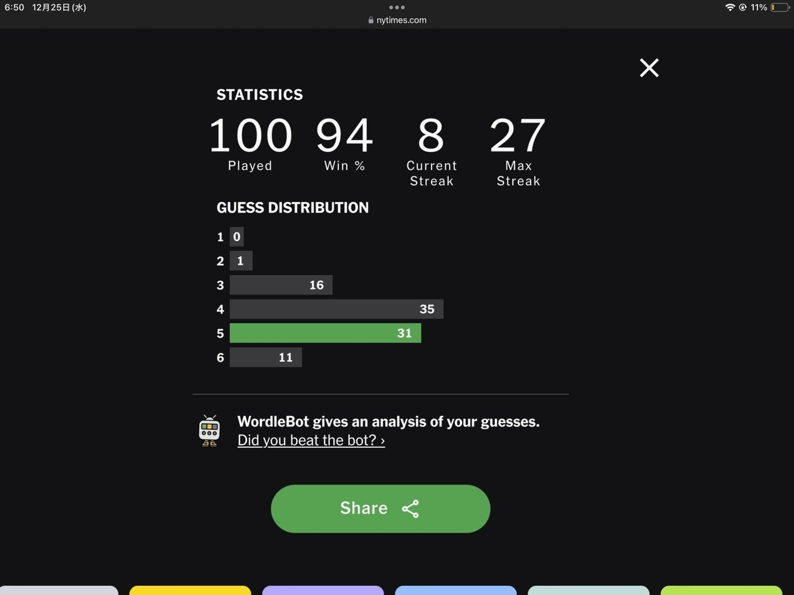

<figcaption>

Wordleのplay回数が100を超えました  
まだまだ知らない英単語だらけです

</figcaption>

</figure>

<figure>

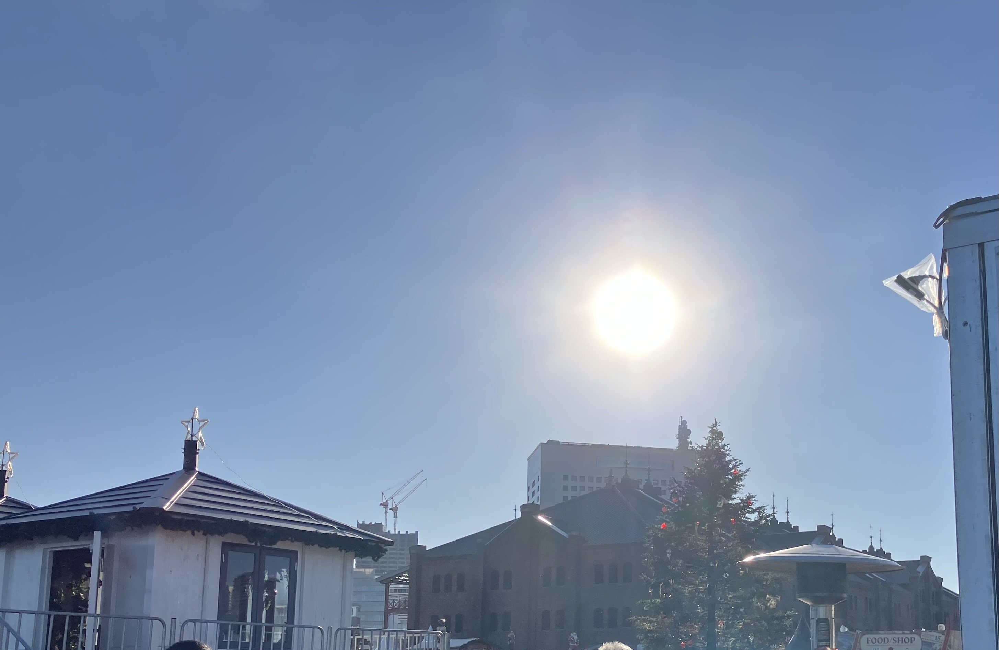

<figcaption>

赤レンガ倉庫のクリスマスマーケットを見てきました  
凄い数の人がいて人気を肌身で実感します

</figcaption>

</figure>

<figure>

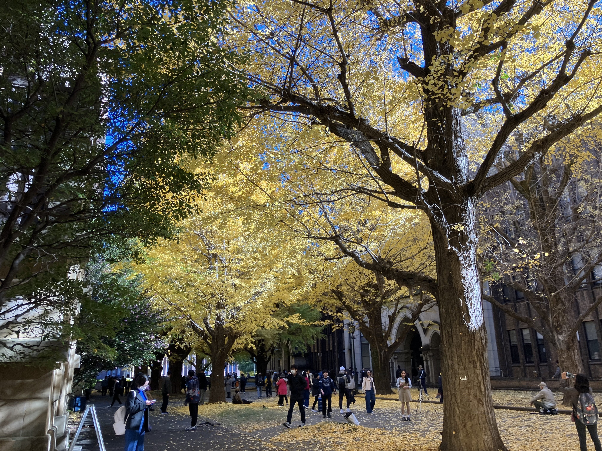

<figcaption>

12月上旬は、銀杏がとても綺麗でした

</figcaption>

</figure>

<figure>

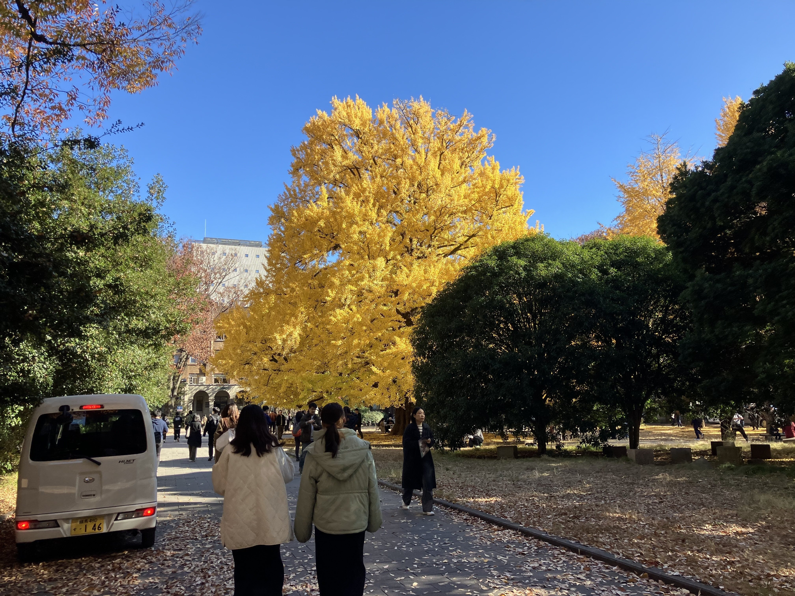

<figcaption>

鮮やかな黄色ですね

</figcaption>

</figure>

<figure>

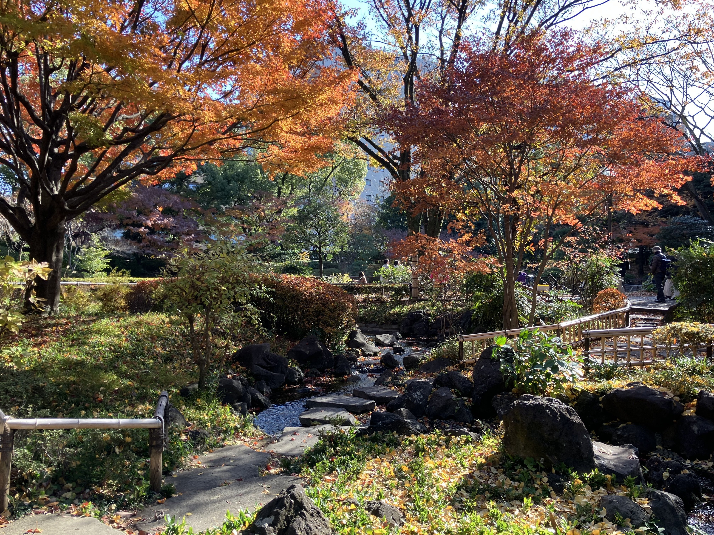

<figcaption>

ICPC横浜大会への道中にあった横浜公園も紅葉が見事でした

</figcaption>

</figure>

<figure>

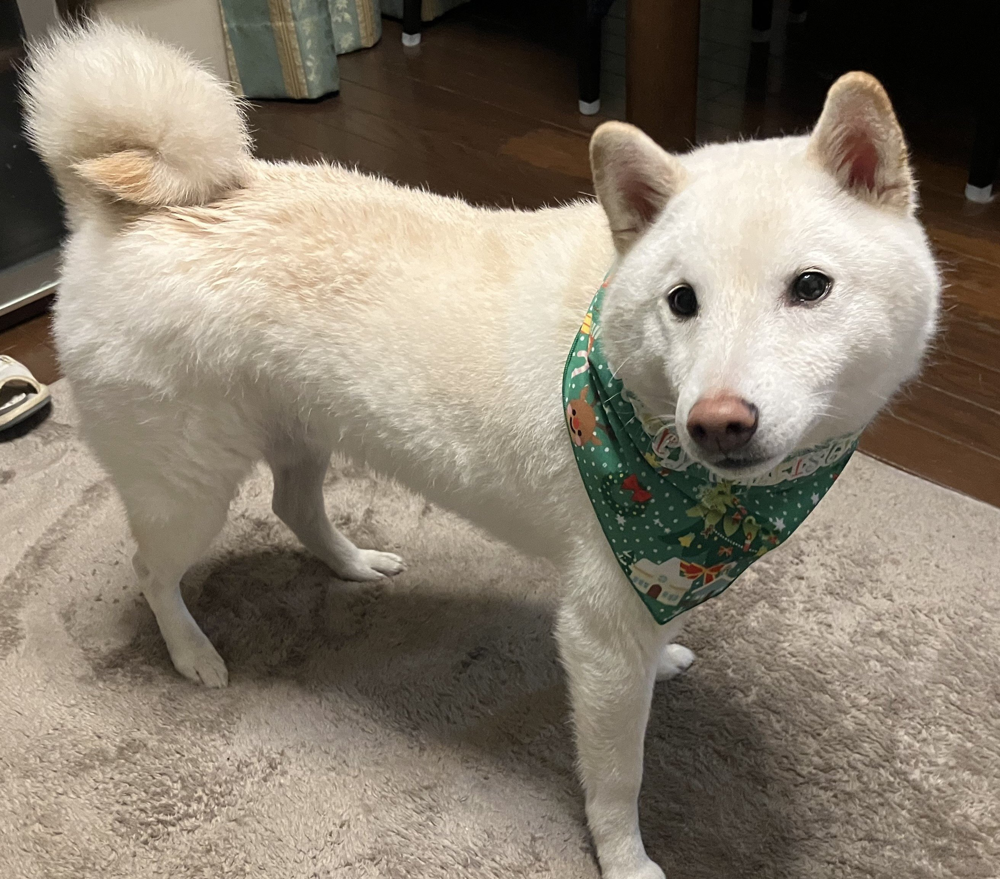

<figcaption>

クリスマスのバンダナを付けた我が家の愛犬

</figcaption>

</figure>

## ICPC2024

ICPC 2024 Asia Yokohama RegionalにチームHHIJKTとして参加して27位でした。  
kumjin君およびmimirot君には楽しい思いをさせてもらい、非常に感謝しています。前年のチームメイトであるHonjo\_Mapleさんとnoyesgoodmanさんを含め、自分のICPCは本当にチームメイトに恵まれました。

<figure>

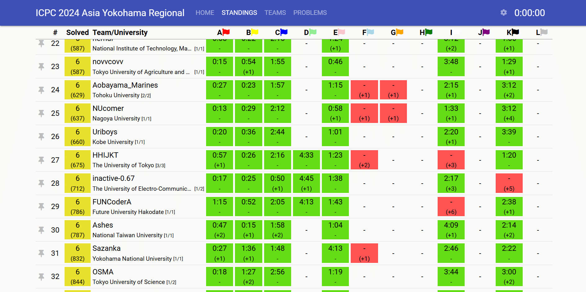

<figcaption>

27位 HHIJKT

</figcaption>

</figure>

大会への準備として、前日までUS配列のキーボードに慣れたり、過去問を解いたりしていました。

<figure>

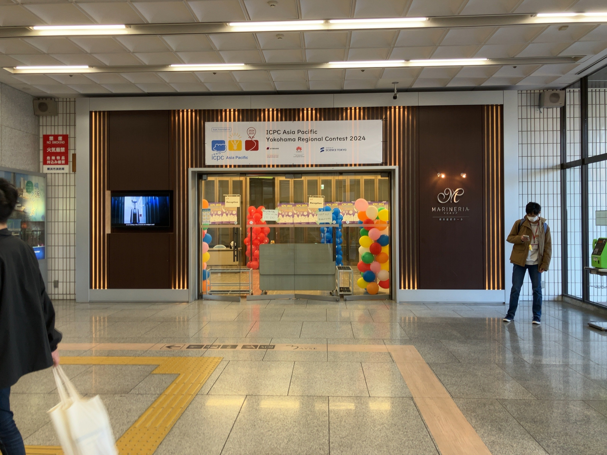

<figcaption>

本番の会場 横浜産貿ホール

</figcaption>

</figure>

A問題は自分が最初書いたのですが、そのミスが非常に悔やまれました。

貪欲に左から順々に塗っていくものなのですが、よくよく考えたら反例(n=3, d=(2,3,1)で2を出す)が存在し、それを修正してお二人が通してくれました。

B問題はkumjin君が通してくれました。

その後はE問題が簡単そうだとなり、簡単な構文解析チックな問題だったので自分が解きました。

<figure>

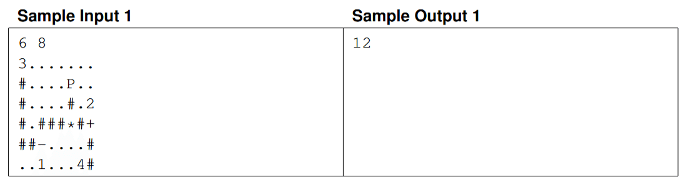

<figcaption>

#を辺と見做すとPを根とする計算過程を表す木が与えられるので、それを計算する問題

</figcaption>

</figure>

同時並行でK問題をkumjin君が通してくれました。

その後、色々な問題を読んでいましたが、C問題が通されているので読むと、最短路木を求めて下さいと読めたのでdijkstraを実装して通しました。

その後もお二人がIなどを含め色々検討してくれ、自分はD問題が通されているので読みました。よくよく考えるとかなり楽に解けると気付いたので、それを実装して通しました。見た目の絶望感かなり凄いですが、整理すると確かになるほど、となるので面白い問題でした。

<figure>

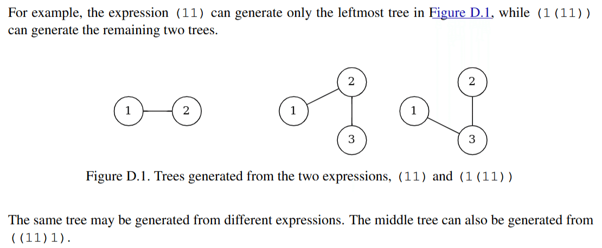

<figcaption>

二つの木を表す括弧列が与えられるので、共通して生成可能な木を数え上げる問題

</figcaption>

</figure>

あとはFやらGやらIやらに手を出して終了でした。

IはGCDに関するクエリの問題で絶対通すべきだったのですが通せず、解説を読んで自分の思考の浅さを思い知らされ打ちのめされていました。Moが駄目だった時点でオンラインクエリっぽく解くことに思考が染まってしまっていたのですが、制約の小ささを活かしながらオフラインでやればいいという発想は全く出ませんでした。

懇親会は色々楽しめて、Huawei様からパンダのぬいぐるみをもらうなどしました。今は自分の鞄につけています。大切にします。

後日、例の特任助教さんがJの出題者だったのでその解法を聴いたのですが、これを解ける1位のチームは本当に凄いという感想です。主催等をして下さった審判団の方々には本当に頭が上がりません。自分はJAGに入会したので、今後少しずつコミュニティに恩返しが出来ればと思います。

本当にチームメイトのお二人、kumjin君およびmimirot君には感謝してもしきれません。来年も彼らは出られるそうなので、是非また横浜大会には進んで欲しいものです、応援しています。ありがとう。

<figure>

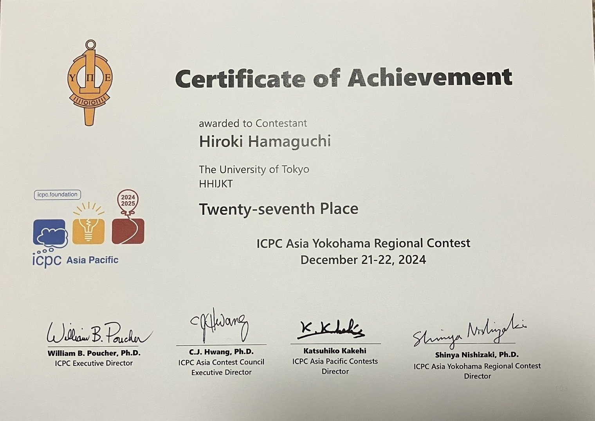

</figure>

* * *

来年もどうぞよろしくお願いいたします。
