<figure>

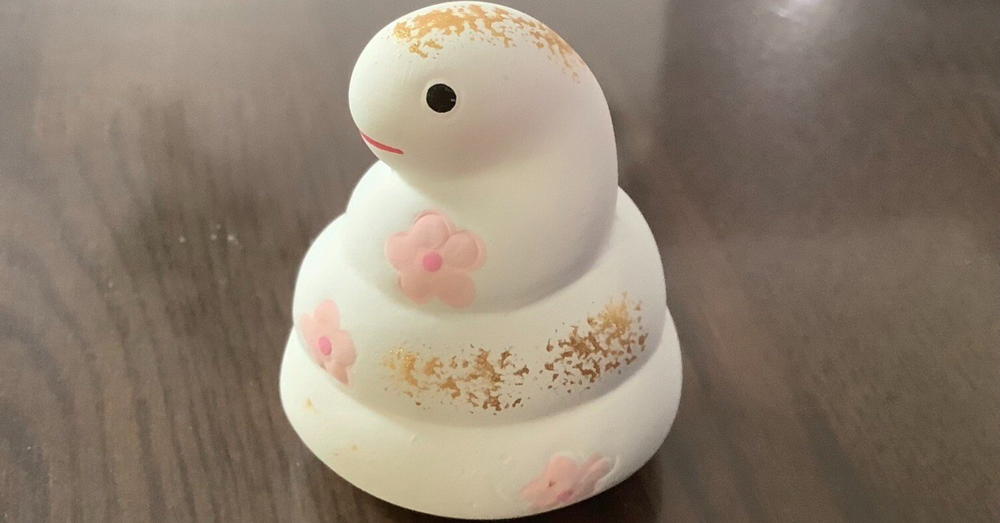

</figure>

## 新年

<figure>

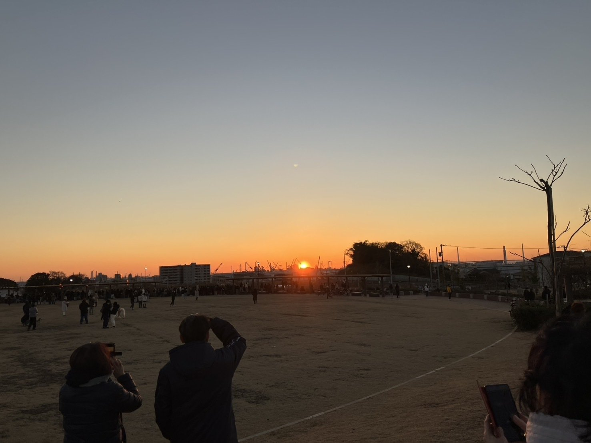

<figcaption>

初日の出

</figcaption>

</figure>

<figure>

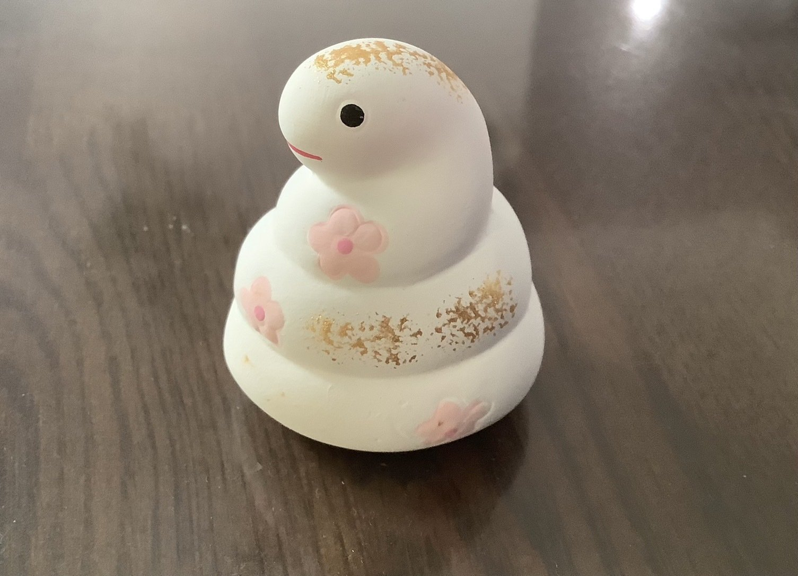

<figcaption>

干支である蛇の入れ物に入ったおみくじ

</figcaption>

</figure>

<figure>

<figcaption>

結果はこんな感じでした

</figcaption>

</figure>

良いお正月を今年も過ごせました。

##   
バイト

最近Juliaを仕事で使っているのですが、言語機能のレベルで合字を採用しているらしく、ビックリしました。そんな言語も存在するんですね。

<figure>

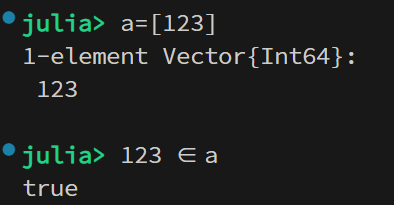

<figcaption>

123 in a ではなく 123 ∈ a

</figcaption>

</figure>

[https://stackoverflow.com/questions/59978282/is-there-an-elegant-way-to-do-not-in-in-julia](https://stackoverflow.com/questions/59978282/is-there-an-elegant-way-to-do-not-in-in-julia)

## 趣味

LaTeX Lintを作りました。

[https://marketplace.visualstudio.com/items?itemName=hari64boli64.latexlint](https://marketplace.visualstudio.com/items?itemName=hari64boli64.latexlint)

校正用ツールです。結構作って良かったなぁとよく思います。バグだらけでこの1ヶ月間ずっと修正に追われるなどしました。

ところで、とある人にとある大学の試験問題を見せてもらう機会があり、どう考えても誤読するだろうという表記がされていてビックリしたのですが、出題者をググったらそれなりにご活躍されてる研究者の方で更にビックリしました。

冷静に考えると、まぁ、そういう表記をしても間違いではないよなと思うのですが、やはりかなり悪い表記だとは思います。

こういう非本質な記法や表記の問題は奥が深く、意味論に立脚しないと検出できないし気が付きにくいよなとも思います。究極的にはこういうミスこそ検出したいのですが、それを可能にするのは正規表現ではなくLLMなんでしょうか。

ところで、これは趣味というより広義の就活に近いですが、Webページを昨日から作っています。楽しい。

[https://hirokihamaguchi.github.io/](https://hirokihamaguchi.github.io/)

## 旅行

1月16日と17日に、友人2人と苗場スキー場へ行きました。

<figure>

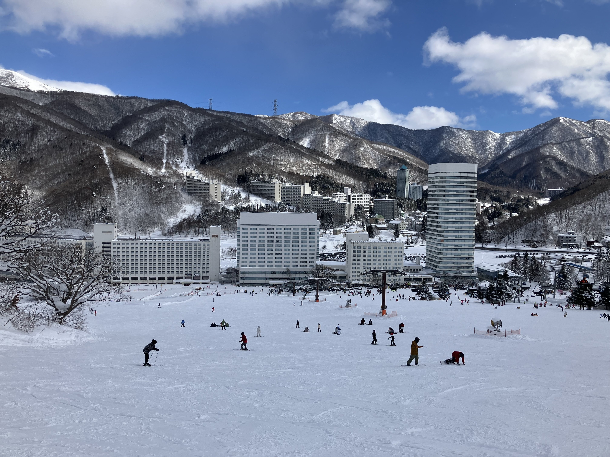

<figcaption>

スキー場

</figcaption>

</figure>

<figure>

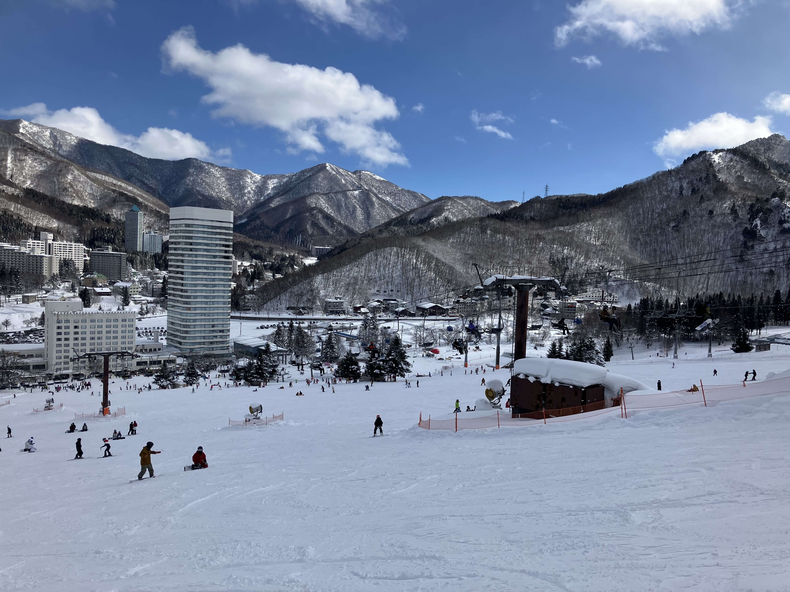

</figure>

<figure>

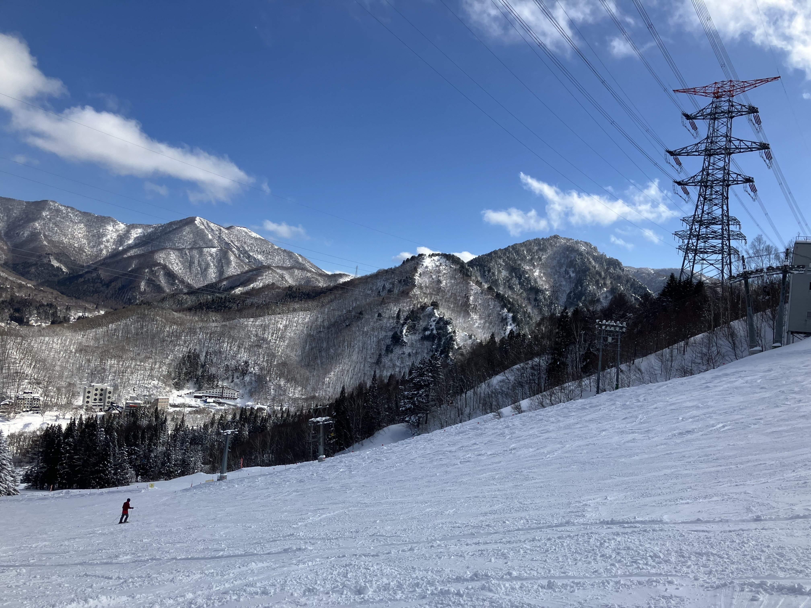

</figure>

<figure>

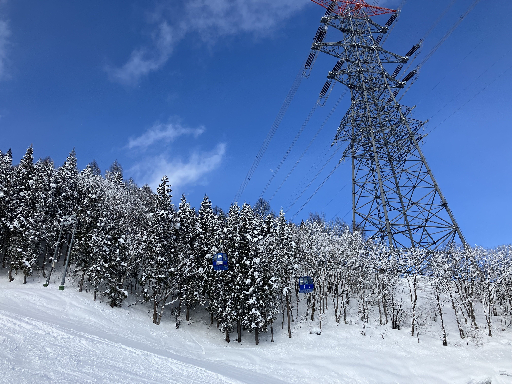

</figure>

<figure>

<figcaption>

夜は謎の花火が打ち上がっていました

</figcaption>

</figure>

<figure>

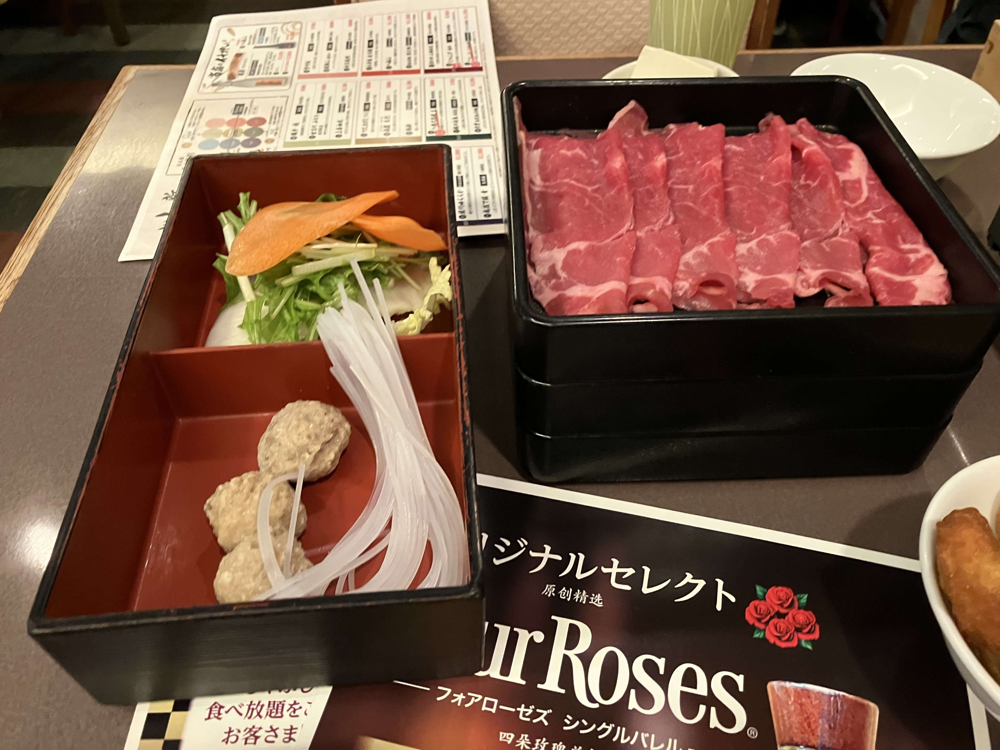

<figcaption>

しゃぶしゃぶ食べ放題  
美味しかったです。  
お肉は2種類しかありませんでしたが。

</figcaption>

</figure>

<figure>

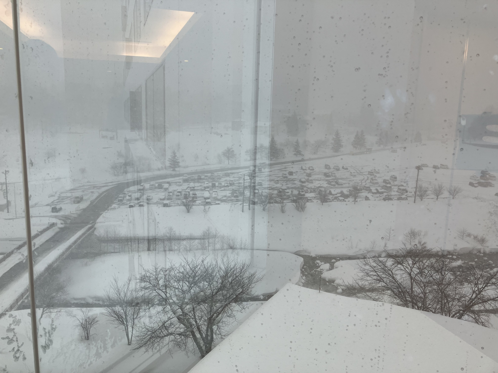

<figcaption>

2日目はかなり吹雪でした

</figcaption>

</figure>

<figure>

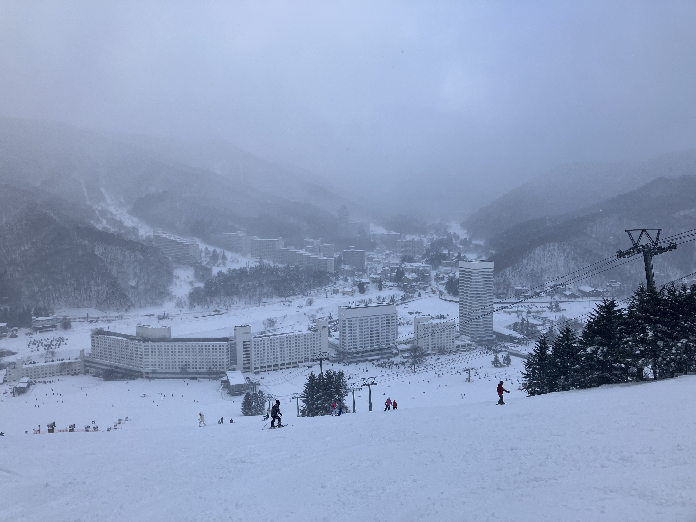

</figure>

<figure>

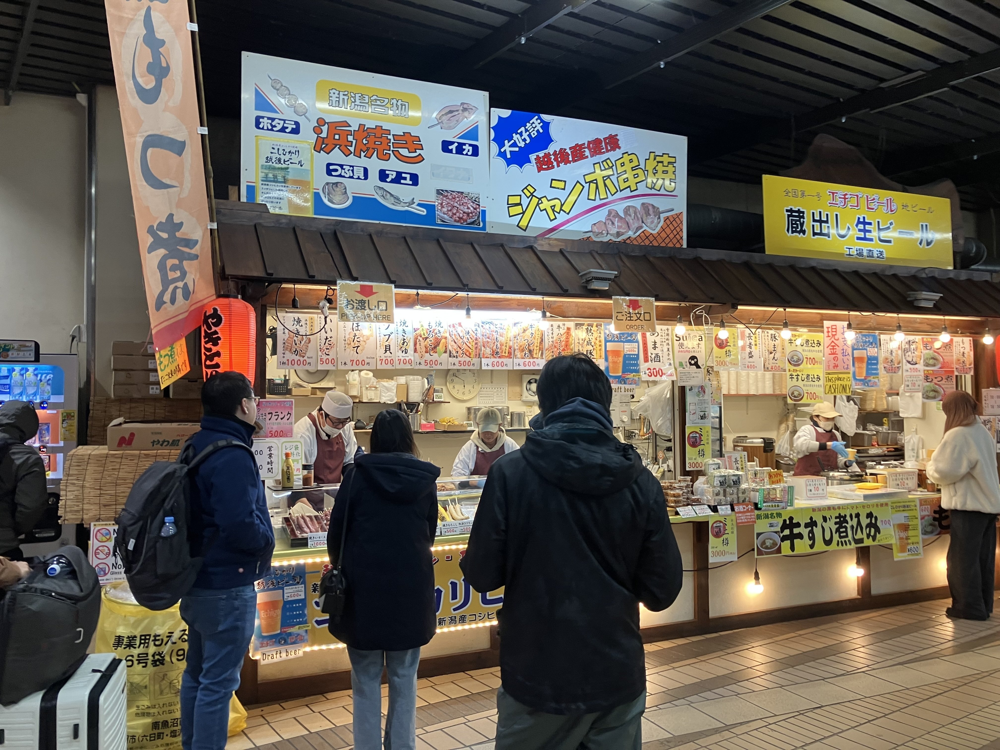

<figcaption>

帰りにいつも食べてる串焼きを食べました  
いつもと変わらない味で美味しかったです

</figcaption>

</figure>

<figure>

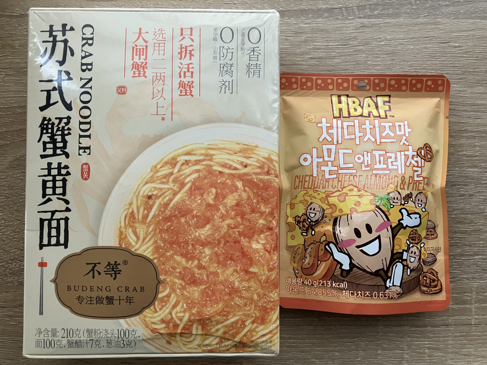

<figcaption>

友人が中国と韓国に旅行してきたらしく、  
お土産を頂きました。どうもありがとう。

</figcaption>

</figure>

友人二人にはいつも感謝しています。ありがとう。

## MBTI

どうでもいい話なのですが、MBTI、いわゆる16 Personalitiesについて少し違った認識の仕方があることに最近気付きました。

私はそもそもMBTIは唾棄すべき類型論の一つに過ぎないと思っていてかなり嫌いです。ただ、去年に元カノが「お前は絶対xxxxだ」と自信を持って主張していたので試したら、自分がその分類の内の一つにかなり典型的な人間として当てはまり（正確に言うと客観視事実の予測に成功され）ビックリする、みたいなことがありました。このxxxxが何だったのか今となっては思い出せないので、その主張が真だったかどうかは分かりません。

最近気づいたことの内容は、質問に対する回答をベクトルとした時に、MBTIは人々を16個の集団にクラスタリングをしようとしているのだ（要はMBTIのやっていることは分類の最適化問題を原義ヒューリスティックに解いていると見做せる）ということと、よく当てはまるか否かはクラスタリングの中心付近に位置するか否かとほぼ同義だと捉えられるということです。

<figure>

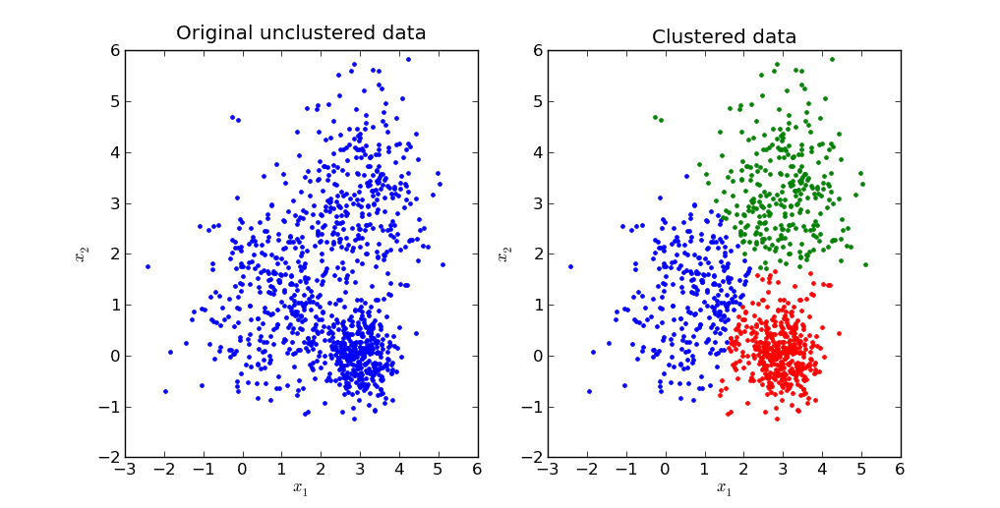

<figcaption>

クラスタリングのイメージ

</figcaption>

</figure>

例えば「定期的に新しい友人を作ることを心掛けていますね。」をX軸に、「単純明快なアイデアよりも、複雑で斬新なアイデアのほうがワクワクする。」をY軸にとり、回答をプロットしクラスタリングすれば、こんな風に恣意的な分類が出来るのだろうな、というのがざっくりとした説明です。

人口に膾炙したMBTIは金箔とカラーチョコスプレーにまみれすぎていて偏見がありましたが、最近その主張する内容に共感するものがあったのでこういうことを思っていました。

* * *

最近は米津玄師さんのPlazmaとBOW AND ARROWを聴いたり、Mrs. GREEN APPLEさんの音楽も久しぶりに聴いたりしたのですが、どれもいい曲ですね。

[https://www.youtube.com/watch?v=GjC4SznBD\_A](https://www.youtube.com/watch?v=GjC4SznBD_A)

[https://m.youtube.com/watch?v=su5oj4X9\_AU](https://m.youtube.com/watch?v=su5oj4X9_AU)
