<figure>

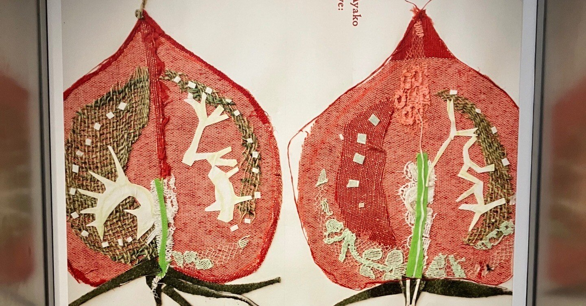

</figure>

## 学問

今月は競プロを除いて学問というか研究をしていました。一個の論文が速攻でrejectされたので次の手を打つ必要があり、結果として4個くらい研究課題(rejected、修士、RA、学振)が生まれてかなり辛かったです。2個くらいがちょうどいいな……。でも来月もこの状況が改善する訳がなくて今から憂鬱です。

修士の研究に関連して、以下の記事を書きました。

[https://qiita.com/hari64/items/f05fea3f9142826c1031](https://qiita.com/hari64/items/f05fea3f9142826c1031)

ありがたいことにこれに対して指摘を頂いて、最初はまるで意味が分からず一体どうなっているんだという気持ちでしたが、結局自分が間違っていて恥ずかしい思いをしました。記事では文脈から自明も許されないので、自分の研究で使う際は体をRかCに限定すべきと、忘れないよう肝に銘じます。

[https://twitter.com/non\_archimedean/status/1889486157504979180](https://twitter.com/non_archimedean/status/1889486157504979180)

## 散歩

<figure>

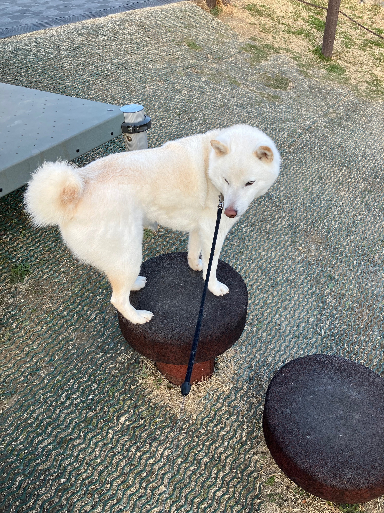

<figcaption>

これは近所の公園です

</figcaption>

</figure>

<figure>

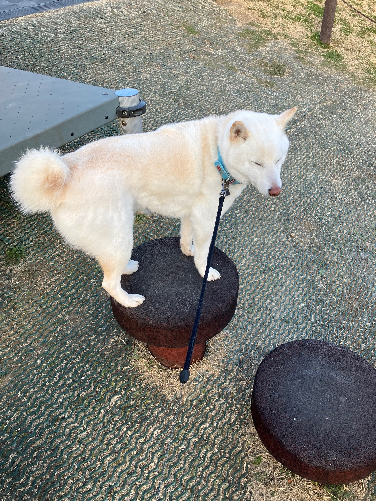

<figcaption>

可愛い

</figcaption>

</figure>

<figure>

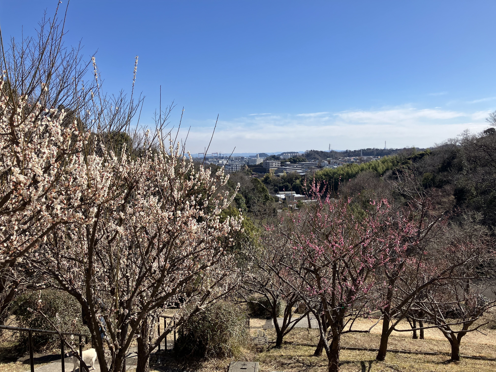

<figcaption>

金沢自然公園に車で行きました  
梅林が綺麗でした

</figcaption>

</figure>

<figure>

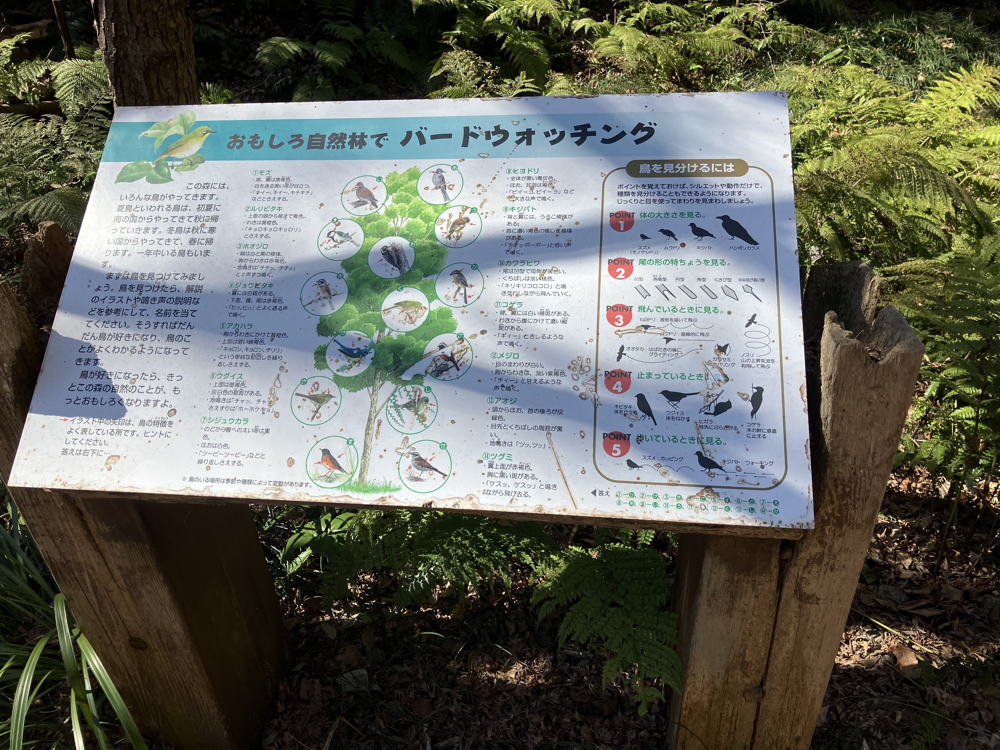

<figcaption>

バードウォッチングの案内  
元々は近所のおじさんにここはリスが出るらしいと聞いて行ったのですが、自分は鳥しか見つけられませんでした。家族はリスを見かけたそうです。

</figcaption>

</figure>

<figure>

</figure>

<figure>

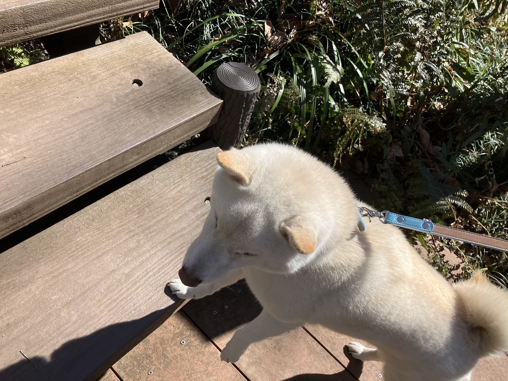

</figure>

運転の際に高速に乗ったのですが、あまりにも周りが法定速度を守らないので、法とは何かとか、なぜ私は法を守るのかとかそんなことを最近は考えていました。

## バイト

校正のバイトで珍しくここに書ける内容かつ面白い話がいくつかあったので、記そうと思います。

### 義務

最近、法律用語という概念があることを再認識し、少し気をつけるようになりました。自分が再認識したきっかけは「悪意」です。

<figure>

> 法律用語としての「善意」とは、ある事実を知らないこと、又は信じたことをいいます。知らないことと読むか、信じたことと読むかは条文によって異なります。  
> ……  
> 法律用語としての「悪意」とは、知っていること、又は信じていなかったことをいいます。

<figcaption>

[意外と知らない？〜法律上の「善意」と「悪意」の意味〜](https://niigata-aoyama.com/topics/%E3%82%B3%E3%83%A9%E3%83%A0/%E6%84%8F%E5%A4%96%E3%81%A8%E7%9F%A5%E3%82%89%E3%81%AA%E3%81%84%EF%BC%9F%E3%80%9C%E6%B3%95%E5%BE%8B%E4%B8%8A%E3%81%AE%E3%80%8C%E5%96%84%E6%84%8F%E3%80%8D%E3%81%A8%E3%80%8C%E6%82%AA%E6%84%8F%E3%80%8D/)

</figcaption>

</figure>

普通の意味の悪意とは全く違い、知った時は結構驚きました。

それと似たような感じで、原稿にて条文の「責務」が「義務」に変わっていて、これはいいのか? と疑問に思っていました。

義務 ⊆ 責任 + 義務 = 責務 かと思っていたんですが、Wikiを見ると当該箇所でこの二つを混在させており、どっちが正解かまるで分かりません。

調べると、[こういう話](https://oshiete.goo.ne.jp/qa/1091071.html)や[こういう話](https://www.zukairoppo.com/glossary-gimu)（図解六法）があり、結局、無難な書き換えを提案しておきました。上司は法学部出身らしいので、あとは大丈夫でしょう。それにしてもこの手の無知はとても恐ろしいものです、日常用語に擬態して中々気付けませんし、気付いたとしても自信を持って判別出来ません。

尤も、こういう自然言語の定義にこだわって法律が書かれているのは素晴らしいことだとよく思います。自分は数学しか碌に知りませんが、数学では定義と主張と証明なら多くの場合で定義が最も大切ですし、通底した精神があるのかも知れません。

### 基線

領海や排他的経済水域の定義は基線から何海里とされています。では基線の定義は何か、ということを考えると、これが非常に非自明だと最適化分野の人には伝わるかも、ということを思っていました。

<figure>

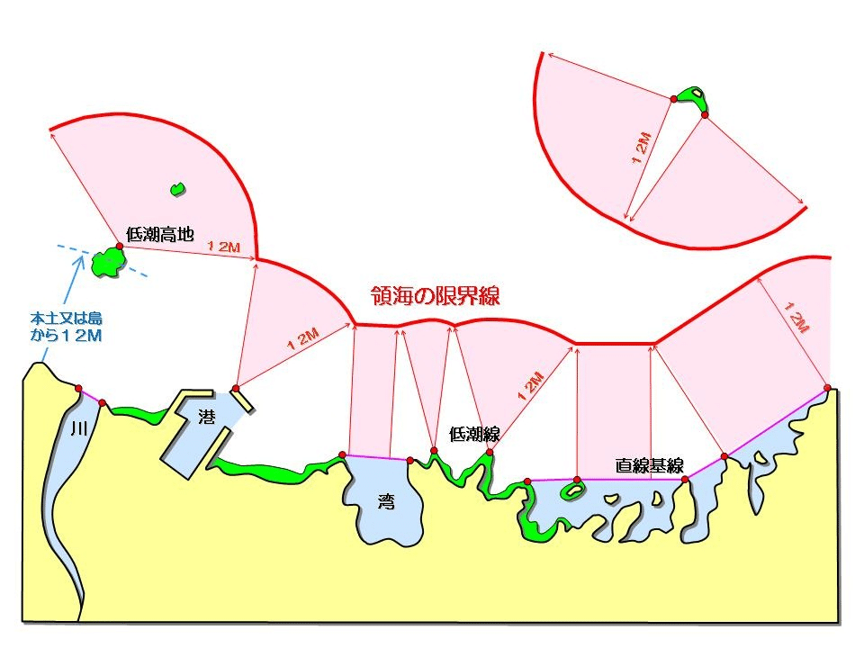

<figcaption>

海上保安庁 海洋情報部 「[領海、基線について](https://www1.kaiho.mlit.go.jp/ryokai/keika.html)」より引用

</figcaption>

</figure>

上の図を見ると基線の定義が全くwell-definedではないことに気付きます、特に直線基線の部分です。こんな直線は領土が非凸なのでいくらでも恣意的に引けてしまいます。例えばこの図の直線基線は2本の折れ線ですが、これをまとめて1本にしてもおかしくはありません。

こういう話を考えると凸包はwell-definedで偉いなぁとなりますが、一方で日本の領土は非凸ですし、基線を凸包で定めたら隣国とのトラブルは免れません。どうやって定義しているのか非常に気になったのですが、どうやら割と人為的な決め方をしているらしいです。

<figure>

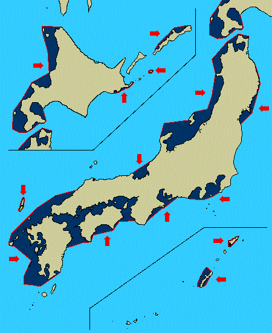

<figcaption>

海上保安庁 海洋情報部 「[直線基線とは](https://www1.kaiho.mlit.go.jp/ryokai/kakudai/itiran.html)」より引用

</figcaption>

</figure>

<figure>

> 海岸が複雑に湾入していたり本土から至近距離に島が散在する場合には、直線基線方式が採用される\[2\]\[3\]。直線基線を引くことによって通常基線を引いた場合よりもより広い内水・領海を確保しようとしたノルウェーによる措置の適法性が争われた1951年のノルウェー漁業事件（英語版）国際司法裁判所判決では、それまで通常基線方式の採用が慣例として認められてきたことを確認しながらも、基線が海岸線の一般的方向から逸脱していないことや、直線基線方式の採用によって内水として取り込まれる水域と陸地部分との間に経済的要因などを考慮して密接な関連があることを条件として、直線基線方式の採用を認めた\[2\]\[3\]\[14\]。

<figcaption>

Wikipedia 「[基線 (海)](https://ja.wikipedia.org/wiki/%E5%9F%BA%E7%B7%9A_\(%E6%B5%B7\))」より

</figcaption>

</figure>

こういった取り決めをした人々の中にもしも数学者がいたら、もう少し違う基線と領海になっていたんでしょうか。

### 博物館

[https://globe.asahi.com/article/14797344](https://globe.asahi.com/article/14797344)

たまたまこの記事を見かけて、めちゃくちゃ面白そうだなと思っていました。第一次世界大戦後のドイツで起きたハイパーインフレーションについて展示をしている貨幣博物館だそうです。

<figure>

> そのときには、「中央銀行の役割を想定した」というゲームがあった。左側に「もの」、右側に「お金」が表示され、真ん中のレバーで通貨供給量を調節する。  
> つまり、レバーで金融緩和と引き締めを操作するのだが、タイミングが少し遅れただけで、あっという間にインフレになってしまう。  
> ゲームの説明にも「気をつけて！　タイムラグがあるから、考えているより簡単じゃないよ！」と書いてあった。

<figcaption>

「[ドイツに禍根残したハイパーインフレの恐怖　卵の値段1兆倍、札束が子どものおもちゃに](https://globe.asahi.com/article/14797344)」

</figcaption>

</figure>

<figure>

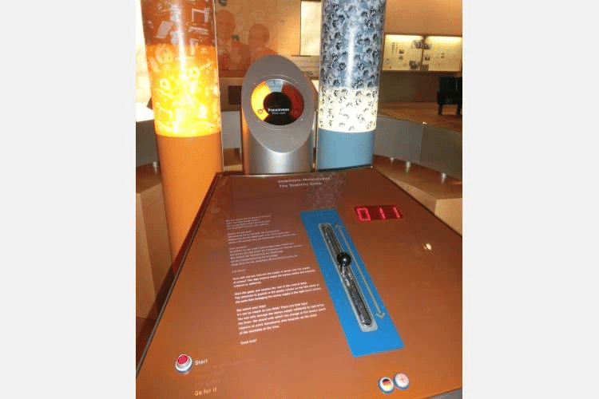

<figcaption>

上記引用にあるゲーム

</figcaption>

</figure>

ブラックジョークみがあって個人的には好きでした(笑)

## 美術館

東京ステーションギャラリーへ輪読の帰りに寄り、「宮脇綾子の芸術」を見てきました。

場の殆ど全てがおばあちゃんで満ちていて面白かったです。作品の全てが祖母を想起させますし、観ている方々もまたお年を召したご婦人ばかりでした。ここまで性別と年代の偏った美術展は初めてかも知れません。

<figure>

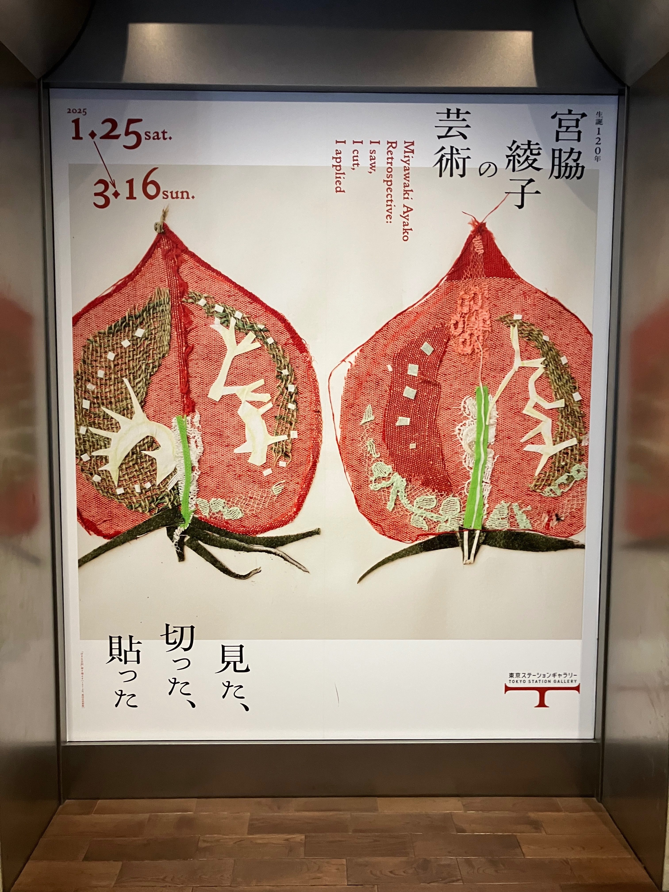

<figcaption>

宮脇綾子さんはアプリケ作家です。  
「アップリケ、アプリケ (仏: appliqué) とは、土台となる布の上に、別の布や皮などの小片を縫い留めたり、貼り付ける手芸を指す。」(Wikipedia「アップリケ」より)

</figcaption>

</figure>

<figure>

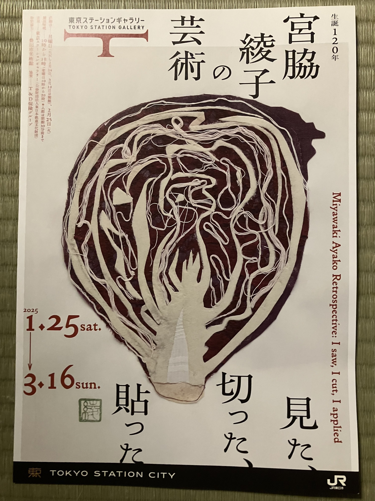

<figcaption>

チラシ

</figcaption>

</figure>

<figure>

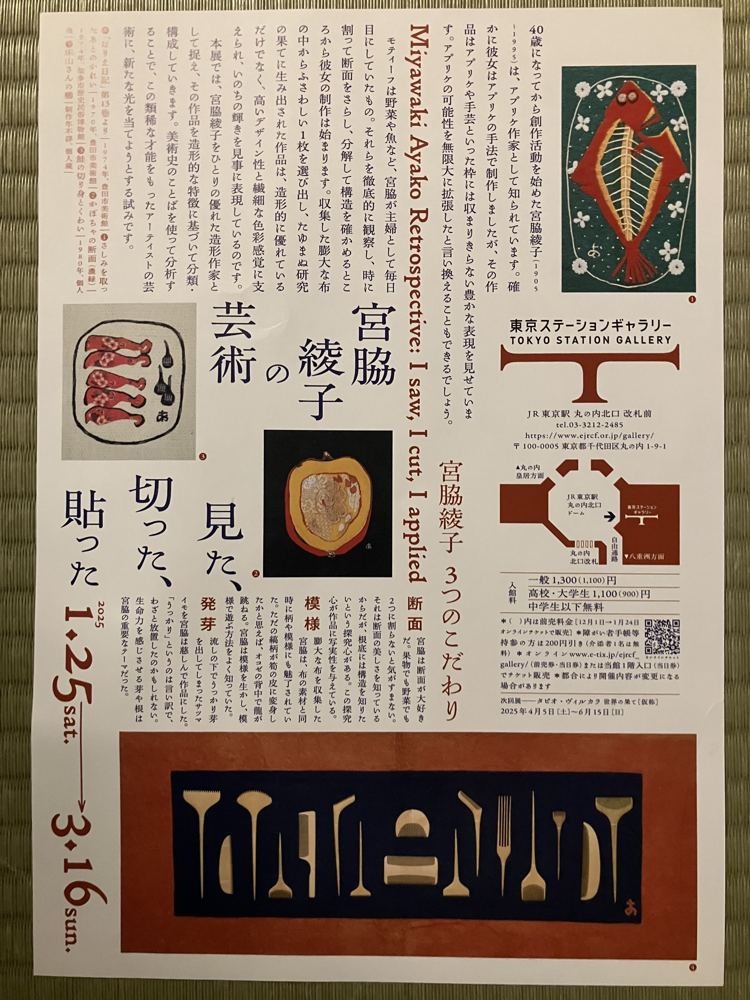

<figcaption>

　右上の「さしみを取った後のかれい」では、  
骨が糸で表現されており、  
このような表現は初めて見ました

</figcaption>

</figure>

以前行ったフォロン展は題材の選び方に感心していましたが、今回は対照的に表現方法に感心していました。

「しゃけ」では本物の紐がアプリケの鮭の口からエラに通されていて、いや本物やんけと思っていました、このような手法ならではですね。「吊った唐辛子」（秋田県の八百屋にモチーフがあったらしい）「吊った干しえび」も似た感じでした。

<figure>

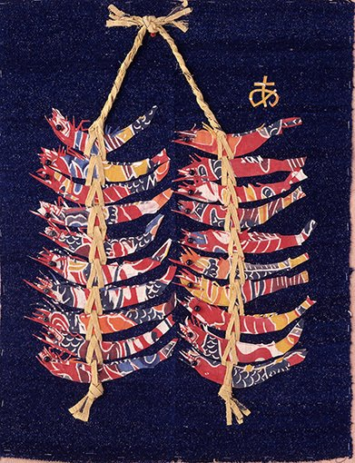

<figcaption>

[https://www.museum.toyota.aichi.jp/collection/miyawaki-ayako](https://www.museum.toyota.aichi.jp/collection/miyawaki-ayako)  より画像を引用

</figcaption>

</figure>

布や糸などを使っていらっしゃるので、玉ねぎの根の部分を糸で表現したり、レースを切り貼りして情報量を増やしたり、コーヒーフィルターをするめに見立てて「フィルターのするめ」を作っていらしたり、発想が面白かったです。

[https://artexhibition.jp/topics/news/20250124-AEJ2566343/](https://artexhibition.jp/topics/news/20250124-AEJ2566343/)

上の記事のリンクカードにもなっている「めざし」は石油ストーブの芯を使っているそうなのですが、そもそも石油ストーブの芯を初めて目にしました。

<figure>

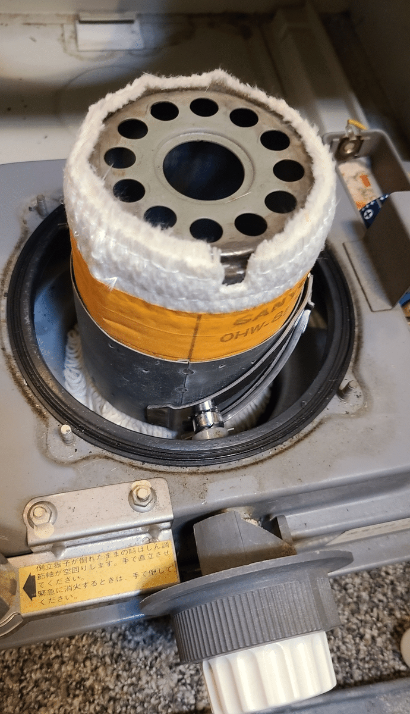

<figcaption>

[https://tak6780.hatenablog.com/entry/2021/02/14/083528](https://tak6780.hatenablog.com/entry/2021/02/14/083528)  より画像を引用

</figcaption>

</figure>

[更紗](https://ja.wikipedia.org/wiki/%E6%9B%B4%E7%B4%97)や「鶴亀模様の鯛」という模様の入った布を用いた作品も多く、もう少し私に知識があればもっと「これをこう使うのか!」みたいな楽しみ方も出来たのでしょうが、多くの素材が初見だったので、普通にこの布欲しいなみたいな的外れな(?)ことも考えていました。

<figure>

<figcaption>

[https://kaisyuucom.livedoor.blog/archives/53319114.html](https://kaisyuucom.livedoor.blog/archives/53319114.html)  より画像を引用

</figcaption>

</figure>

<figure>

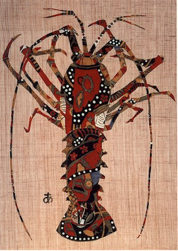

<figcaption>

「伊勢えび」個人的にはこの作品が一番好きでした  
[https://www.museum.toyota.aichi.jp/collection/miyawaki-ayako](https://www.museum.toyota.aichi.jp/collection/miyawaki-ayako)  より画像を引用

</figcaption>

</figure>

<figure>

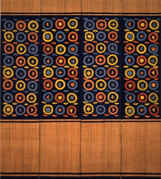

<figcaption>

「ピーマン断面模様屏風」個人的にはこれが題材的に一番好きでした。  
ピーマンって肉詰めとか千切りとかで縦にしか自分は切りませんが、  
横に切った上で抽象化して幾何学的に表すとこんな風になるんだと、かなり感動していました。  
[http://www.meito.hayatele.co.jp/exhibition/2015/1601.html](http://www.meito.hayatele.co.jp/exhibition/2015/1601.html)  より画像を引用

</figcaption>

</figure>

そして最後にこれを見て衝撃を受けていました。リンクカードにある一個一個の物体が全て干柿です、魚もありました。

[https://jbpress.ismedia.jp/articles/gallery/86402?photo=6](https://jbpress.ismedia.jp/articles/gallery/86402?photo=6)

<figure>

> 会場の最後に展示された『縞魚型文様集』全22巻と『木綿縞乾柿型集』全15巻は、その圧倒的なボリュームに驚かされる。それぞれの画帖に魚と干柿がびっしりと貼り付けられているのだが、その数どちらも1万点。宮脇は新しく布が手に入るたびに、小さな魚と干柿をひとつずつ切り抜き、それが一定数集まると画帖に貼り付けていったという。

<figcaption>

[「「世の中に廃物なんか一つもない」アプリケ作家・宮脇綾子の芸術を再検証、使い古した布切れに新たな生命を吹き込む」](https://jbpress.ismedia.jp/articles/-/86402?page=3)

</figcaption>

</figure>

最近Twitterで、ある理論系の研究者が「研究室見学に来た学生に1000枚くらいの手書きの計算メモを見せたらドン引かれた」みたいな呟きをしていましたが、割とそれに近そうです(笑)  
こういう基礎体力みたいなものが研究や作品を支えるのでしょうか。

* * *

  
ところで、宮脇綾子さんは40歳になってから創作活動を始めたとあり、ぼんやり遅咲きなんだなぁ程度に思っていましたが、生まれが1905年なので、そうか、1945年なのか、と帰り際に気が付きました。  
  
今月で戦争も3年が経ちました。

[https://twitter.com/ZelenskyyUa/status/1893903871040463251](https://twitter.com/ZelenskyyUa/status/1893903871040463251)

[https://twitter.com/ZelenskyyUa/status/1893956340441108517](https://twitter.com/ZelenskyyUa/status/1893956340441108517)

* * *

今日が誕生日の友人に、LINEギフトで抹茶最中を送ったら喜んでもらえました。良かった。お誕生日おめでとう。
