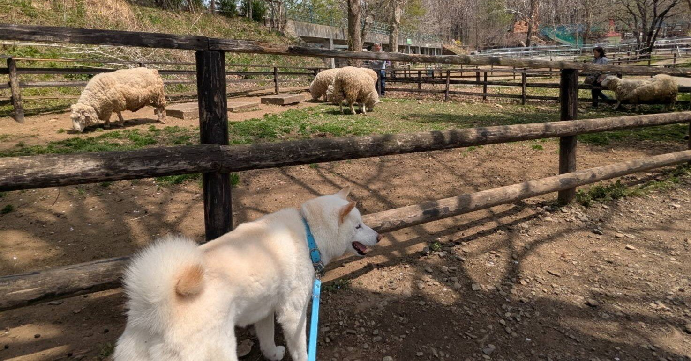
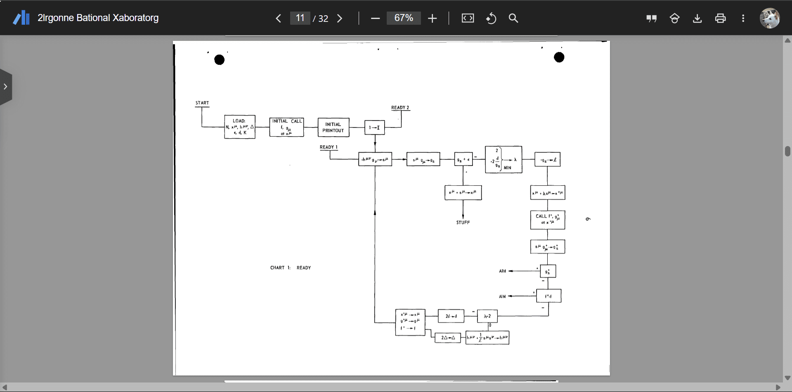
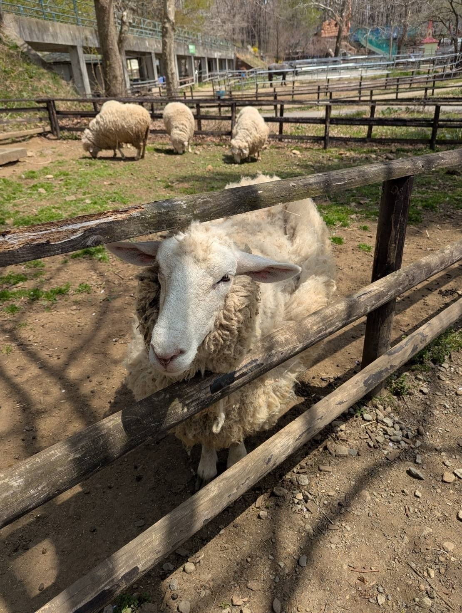
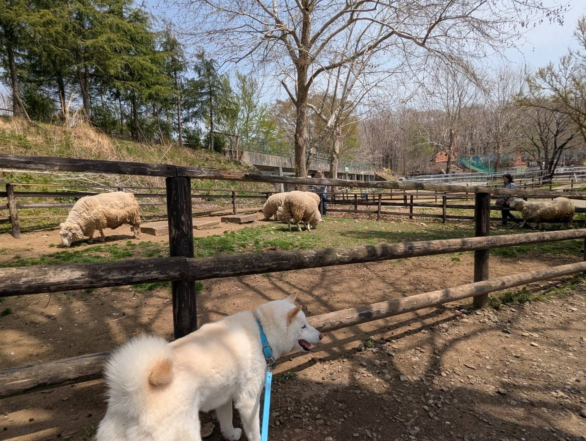

<figure>

</figure>

## 学業

「局所的」の「局」の字をこれまでずっと間違えて覚えていたことを助教さんに指摘されました。線がもう一本あると思っていた。馬鹿すぎ。

### 学振

今月は学振を書いていました。

学振それ自体にかけた時間は少ないはずですが、それ以前の問題として研究方針があまりに定まらず、辛かったです。最終的にまともな方針が出来たと（今は）思っているので一安心です。

古い論文を過程で読み、下図みたいなアルゴリズムの概略図を見つけ、昔の人ってこんなダイアグラム書いてたんだスゲーとなりました。今は擬似コードしか書かないですし。

<figure>

<figcaption>

Davidon, W C, "VARIABLE METRIC METHOD FOR MINIMIZATION," (1959), https://doi.org/10.2172/4252678

</figcaption>

</figure>

ところで、経験のある方に読んでもらう機会の多寡などによる、研究室や大学に依存した有利不利が出るのかなり嫌だなという気持ちにずっとなっているので、その内何らかのnoteでも書くかも知れません。果たして誰かの参考になるのか? という疑問しかないですが、自分の備忘録にもなりますし。

### 研究

[https://twitter.com/hari64boli64/status/1912021258059014211](https://twitter.com/hari64boli64/status/1912021258059014211)

嬉しい。

[https://twitter.com/ene\_prog/status/1912315652783894727](https://twitter.com/ene_prog/status/1912315652783894727)

[https://twitter.com/mirucaaura/status/1912042744908054626](https://twitter.com/mirucaaura/status/1912042744908054626)

こういう言葉を自分は御守りにして生きていきます。

### 授業

「理系のための法学入門」というのを唯一履修登録しました。e-Govとかを授業で扱って、ようやく本物（?）が聴けたなぁと感動です。

ガイダンスの話が印象に残っていて、大谷選手の打球がホームランになるのかを、東京ドームの規則や立証責任の話と絡めて説明されていました。

[https://news.yahoo.co.jp/articles/9c6f4641776311b2ea652879f89e83e1ce88f2e6](https://news.yahoo.co.jp/articles/9c6f4641776311b2ea652879f89e83e1ce88f2e6)

[https://izawa-law.com/blog/lawyer/3118.html](https://izawa-law.com/blog/lawyer/3118.html)

<figure>

> 事実が存在しないという証明は、悪魔の証明といわれ、およそ立証することは不可能です。そんな不可能なことを法が強いることはありません。

<figcaption>

[https://izawa-law.com/blog/lawyer/3118.html](https://izawa-law.com/blog/lawyer/3118.html)

</figcaption>

</figure>

あとは、大正製薬のステマの話とか（[https://www3.nhk.or.jp/news/html/20241113/k10014637431000.html](https://www3.nhk.or.jp/news/html/20241113/k10014637431000.html)）、破産者マップの話とか（官報として公知の情報でもアウトなのは結構意外でした）。

来月も聴きに行こうと思います。

* * *

## その他

これ本当に好き、可愛い。

[https://twitter.com/livedoornews/status/1910855191575814177](https://twitter.com/livedoornews/status/1910855191575814177)

<figure>

<figcaption>

自分は行きませんでしたが、家族が旅行してきたそうです。

</figcaption>

</figure>

<figure>

<figcaption>

うちの愛犬

</figcaption>

</figure>

### 留学生のビザ

知り合いの知り合いの知り合いである日本人留学生の方がビザを取り消されたニュースを聞き、色々と思い悩みました。最終的にビザが復活されたそうですが、それでもこれが良いニュースだとはまるで思えません。

[https://twitter.com/ParrotMystery/status/1913853130732962244](https://twitter.com/ParrotMystery/status/1913853130732962244)

[https://twitter.com/tweetnakasho/status/1913394780475892205](https://twitter.com/tweetnakasho/status/1913394780475892205)

若干関連のある話題として、こういう話も見ていました。これらの話題に一貫した論理性を自分が持てているのかよく分からなくなります。今後も考え続ける話題の一つになる気がします。

[https://www.asahi.com/sp/articles/AST4L2H1GT4LUTFL001M.html](https://www.asahi.com/sp/articles/AST4L2H1GT4LUTFL001M.html)

## 本

本屋大賞に輝いた『カフネ』と、

[https://cafune.kodansha.co.jp/](https://cafune.kodansha.co.jp/)

人に教えて貰った『おいしいごはんが食べられますように』を読みました。

[https://www.kodansha.co.jp/book/products/0000363638](https://www.kodansha.co.jp/book/products/0000363638)

  

純粋に面白かったという点では圧倒的に前者です（伏線回収の仕方がとても鮮やかで感動したし、暖かい物語でした）が、多分数年後も記憶に強く残っているのは後者だと思います。

後者の本、今の自分には登場人物の心情が殆ど分かりませんでした。ただ、未来において自分がこれをどう感じるかは全く予測できないと感じます。特にこの本の最後の一文、私はなんてひどい真っ赤な嘘だと初め読んだ時は思っていましたが、今はあれこそが一切の偽りのない本心なのだという解釈の方が自然に感じます。

ところで、あまり話の本筋とは関係ないけれど、嘘に関する記述は対比的で面白かったです。

<figure>

> 誰も喧嘩をしないように、泣かないように、苦しまないように、その場しのぎの手をいつでも何とか打ってる。それが長いあいだに積み重なって、結果的に噓になってしまっただけです。

<figcaption>

『カフネ』

</figcaption>

</figure>

<figure>

> 話している間に、二谷さんの表情がどんどん柔らかくなっていくので、わたしの口も止まらず、すらすらと言葉を吐いたけれど、それはほとんどが嘘だった。

<figcaption>

『おいしいごはんが食べられますように』

</figcaption>

</figure>

よく思う事として、嘘の定義は少し広すぎるように思います。  
人間の思考の種類だけ名前があっても良い、世界を分節出来るように。

私が輪読でよく吐く誤謬を意味する数学嘘、  
説明を簡略化するための方便嘘、  
誰かを傷付けない為の配慮嘘、  
それが積み重なった破綻嘘、  
相手に取り入る為に世間話で吐く擬態嘘、  
誰かを騙す悪意由来の詐欺嘘。

私には破綻嘘を吐いた相手がこの世に何人かいて、今でもとても後悔してます。自分の馬鹿さ加減に心底呆れてるからこれは数学嘘に近いんでしょうか。でも客観的に見ればこの嘘も詐欺嘘なのかも知れません。

* * *

今月は色々なことがあって、本当はその全部をこういう月記に書き残しておきたいのですが、無理なので諦めています。思い出したことを思い出した順に垂れ流している。でもそれでいいのかとも思います。

ゆっくりとこの4月を記憶から零れ落ちさせて、それでもまだこの月記を自分が読み返した時に何か思い起こすことがあるなら、それで十分かという気もします。
